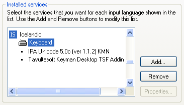

# Add an input language Windows

*Advanced Tasks › Writing Systems › Keyboards*

You must add an input language in Microsoft Windows® before you select it on the [Keyboard tab](../Modifying_a_Writing_System/Writing_System_Properties_Keyboard_tab.md) of the **Writing System Properties** dialog box.

Operating systems change, and adding an input language to your operating system is *beyond the scope* of these user Helps. Therefore, if the steps in this topic do not work for you, refer to your *Windows Help and Support* system for help.

## Add an input language

1.  In Microsoft Windows®, open the **Control Panel** window, and then open the **Text Services and Input Languages** dialog box.

    (Refer to your Windows Help file for assistance if necessary.)

2.  In the **Text Services and Input Languages** dialog box, click **Add**.

    The **Add Input Language** dialog box appears.

3.  In the box, click the plus sign at the left of a language.

    A submenu appears.

4.  Click the plus sign at the left of **Keyboard**.

5.  Select a keyboard.

6.  Click **OK** to close each open dialog box, and then close the **Control Panel** window.

## Verify an input language with Keyman keyboard

> [!IMPORTANT]
>
> - Keyman 9 does not have 64-bit support. You need to use Keyman 10 or later.
>
> - Different combinations of Keyman and Windows® versions can affect the steps you *must do* to verify the input language. These differences include how the **Installed services** pane of the **Text Services and Input Languages** dialog box (Windows) functions and how its contents appear.
>
> - - Here is one possible example of a properly configured **Installed services** pane:
>
> 
>
> - - Depending on your version of Keyman, if **Keyman Desktop TSF Addin** (or just **Keyman**, depending on version) is *not* included in the list, you may experience some problems with that keyboard. For other versions, is should not appear in the list.
>
>   - For more information and steps *you need to do*, on the [Help](../../../User_Interface/Menus/Help/Help_overview.md) menu, point to **Resources** and then click **Technical Notes on Writing Systems**.
>
> - FieldWorks currently allows only one keyboard for each writing system. Do not try to associate more than one keyboard with a writing system.\
>   For example, you could add an input language in your computer's **Text Services and Input Languages** dialog box and associate that input language with a Keyman keyboard. Then later, you may learn of another keyboarding program or choose to try Microsoft Keyboard Layout Creator (MSKLC). Users who have tried this have experienced various problems, so you must choose to use *one* of them at a time.

## Related topics
[Add a new writing system](../Add_a_new_writing_system/Add_a_new_writing_system.md)

[Technical support](../../../Overview/Technical_support.md)

[Writing Systems overview](../Writing_Systems_overview.md)

## Related links
<a href="https://keyman.com/desktop/" target="_blank" title="https://keyman.com/desktop/">https://keyman.com/desktop/</a>
