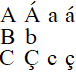

# Sort Custom Simple rules

*Advanced Tasks › Writing Systems › Modifying a Writing System*

You can specify sorting properties of writing systems in FieldWorks similar to the sort order properties of language encodings in *Shoebox* or *Toolbox*.

- You will need a way to enter the characters for your rules. Make sure [Keyman](Writing_System_Properties_Keyboard_tab.md) is running if you use it. You can use [shortcut keys](../../../User_Interface/Shortcuts/Shortcut_keys_to_edit_text.md).

- Review [Shoebox/Toolbox-style sort order](Shoebox_Toobox_style_sort_order.md).

[Use](Writing_System_Properties_Sorting_tab.md) the **Sorting** tab to do these steps:

1.  Click the **Sort** down arrow () and then click **Custom Simple (Shoebox style) rules**.

2.  In the box below **Sort**, type every word-forming combination of base characters and diacritics as a separate *sorting unit*. Examples:

3.  [Test](Writing_System_Properties_Sorting_tab.md) your rules.

> [!IMPORTANT]
>
> - *Primary* sort is determined by the order of the lines.
>
> All sorting units in a line are sorted after any sorting units in preceding lines.
>
> All sorting units in a line are sorted before any sorting units in following lines.
>
> - *Secondary* sort is determined by order of sorting units *within* each line. You cannot specify an independent secondary order for diacritics.
>
> <!-- -->
>
> - Consider a line as a list of one or more sorting units that belong together in a section of a dictionary or word list.\
>   After you determine the basic sort order, generalize the meaning of a line to include sorting units which do not occur at the beginning of words or morphemes, and numeric digits (if they occur in texts or lexical entries).
>
> - Do not type any sorting unit more than once.
>
> - Omit non-word-forming punctuation or linguistic characters from the sorting properties.
>
> - Do not copy sort order properties from Shoebox, Toolbox or language encoding \*.lng files, unless you know for certain that they are in the Unicode character encoding.
>
> <!-- -->
>
> - You may want to [get more help](../../../Overview/Technical_support.md).

## Related topics
[Pathway multigraphs](../../../User_Interface/Menus/File/Pathway_Configuration_Tool/Pathway_multigraphs.md)

[Sorting tab, Writing System Properties dialog box](Writing_System_Properties_Sorting_tab.md)

[Using the Character Map](../../../User_Interface/Menus/Insert/Using_Character_Map.md)
