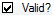

# Valid Characters, From Data tab

*Advanced Tasks › Writing Systems › Modifying a Writing System › Valid Characters dialog box*

One way to add characters in the Valid Characters dialog box is to add characters from a data source. The characters you add become part of the current writing system. The current writing system is identified between the title bar and the tabs.

1.  In the **Valid Characters** dialog box, click the **From Data** tab.

2.  Click the **Scan** button, and then click an option.

    - If you clicked **File**, in the **Browse for Language File** dialog box, select the language file which contains the characters you want to add, and then click **Open**.

      The upper-left pane displays characters, character codes, counts and check boxes in a table.

      The lower-left pane displays examples of the character currently selected (row highlighted) in the upper pane.

3.  To select () all the characters in the **Valid?** column, select the check box in the column header (); clear it to clear () all of the characters.

4.  Decide whether *each* character is valid, one at a time. Unless you know that the character is valid, click the character. Then, in the lower pane, look at the contexts where the character occurs to decide whether it is valid.

    - If you decide the character is valid, select () the **Valid?** check box for that character.

    - If you decide the character is *not* valid, clear () the **Valid?** check box for that character.

5.  Click **Add**.

    The characters for which you selected the *Valid?* check box are added to the **Valid Characters** pane.

6.  Review the characters in the **Valid Characters** pane, and then do any of the following:

    - To add more valid characters from a different data source, repeat the steps above, as necessary.

    - Add characters from a [similar writing system](Valid_Chars_Based_On_tab.md) or [manually](Valid_Chars_Manual_Entry_tab.md).

    - To remove a character you think is not valid, click the character, and then click **Remove**.

    - To remove all characters, click **Remove All**.

7.  Click **OK** in each open dialog box.

> [!NOTE]
>
> - If you want to change the order of the characters in the upper pane, click a column header to sort by that column. Click the column header again to reverse the sort order.
>
> - When scanning data, one reason to choose the **File** option, is to scan data where the characters are likely to be correct. We recommend that you limit your scanning to text-only files where all the data is Unicode.
>
> - If a valid character is in the End User Private Use Area of Unicode or is defined in a newer version of the Unicode Standard than the version of Unicode that FieldWorks supports, select it in the **Custom Characters** area on the [Characters](../Writing_System_Properties_Characters_tab.md) tab of the **Writing Systems Properties** dialog box.
>
> - Language files have .xml as their file name extension, such as Sena.xlm.

## Related topics
[Valid Characters dialog box](Valid_Char_overview.md)
