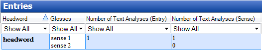

# Number of Text Analyses

*Basic Tasks › Configure Columns*

In L**exicon Edit**, you can [use the Configure Column dialog box](Using_Configure_Columns_dialog_box.md). The following two columns can help you learn how many times entries and senses are used in [interlinearized texts](../../Using_Tools/Texts_%26_Words_tools/Interlinear_Texts/texts_edit_overview.md):

- **Number of Texts Analyses (Entry)** - this column shows you how many times each lexical entry has been selected in text analyses.

You see one number for each lexical entry.

- **Number of Texts Analyses (Sense)** - this columns shows you how many times each sense in each lexical entry has been selected in text analyses.

You see one number for each sense in each lexical entry. The numbers are stacked in the order the sense appear (*unless* you have [sorted](../Sorting_data/Sort_lexical_entries.md) the lexicon on this column).

### Example

## Related topics
[Basic Tasks overview](../Basic_Tasks_overview.md)

[Select the lexical sense for a morpheme](../../Using_Tools/Texts_%26_Words_tools/Interlinear_Texts/Select_the_lexical_sense_for_a_morpheme.md)

[Show in from Lexicon](../Show_data/Show_in_from_Lexicon.md)

[Using Configure Column dialog box](Using_Configure_Columns_dialog_box.md)
