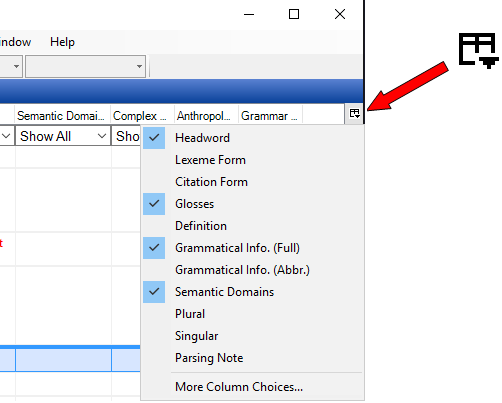

# Configure Column button graphic

*Basic Tasks › Configure Columns*

> [!NOTE]
>
> - The **Lexicon** [Browse](../../Using_Tools/Lexicon_tools/Browse/Lexicon_Browse_overview.md) tool shown with list displayed (button clicked, displayed to the left) as an example. All other occurrences of the feature are similar.
>
> - - The **More Column Choices** menu command opens the [Configure Columns](Using_Configure_Columns_dialog_box.md) **dialog box**.
>
> - For another way to open the **Configure Columns** dialog box, on the **Tools** menu, point to **Configure**, and then click **Columns**.

## Related topics
[Configure Columns overview](Configure_Columns_overview.md)
