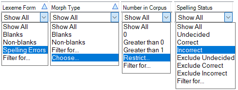

# Filter data down arrow/menu

*Basic Tasks › Filtering data*

Here are some samples of [filter](filtering_data_overview.md) options that appear in the list when you click the down arrow ()under the column heading.

## Related topics
[Filtering data overview](filtering_data_overview.md)

[Using Choose Items](Using_Choose_Items_dialog_box.md)

[Using Filter for](Using_Filter_for.md)

[Using Restrict to items](Using_Restrict_dialog_box.md)
