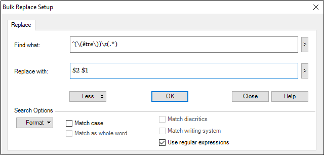

# Example Find and Replace using regular expressions

*Basic Tasks › Find and Replace*

Here is an example a FLEx user has used.

The need was to change "(être) gentil" in the gloss field to "gentil (être)" for all entries that started with (être) and those with (avoir).

The **Bulk Replace** tab in **Bulk Edit Entries** was used. The dialog box looked like this:

- **Find what:** `^(\(être\))\s(.*)`

- **Replace with:** `$2 $1`

> [!TIP]
>
> - The search looks for (être) at the beginning of the field. The outer parentheses are to remember everything inside for the replacement. \\ is used to look for an actual ( since normally ( and ) are metacharacters. \s is a white space. .\* is everything else and since it is in parenthesis, it is remembered for replacement. In the replacement \$2 writes out what was in the second parentheses, and \$1 writes out what was in the first parentheses.
>
> - Then, you need to replace être with avoir for the second pass to handle (avoir).

## Related topics
[Find and Replace overview](Find_and_Replace_overview.md)

[Examples of regular expressions](../Filtering_data/Examples_of_Regular_Expressions.md)

[Examples of combinations of regular expressions](../Filtering_data/examples_of_combinations_of_regular_expressions.md)

[Using regular expressions assistance](../Filtering_data/Using_regular_expressions_assistance.md)
