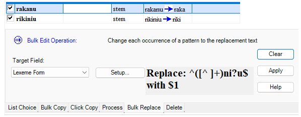

# Find and Replace using regular expressions

*Basic Tasks › Find and Replace*

Various **Find and Replace** dialog boxes and the **Bulk Replace Setup** dialog box allow you to use [regular expressions](../Filtering_data/About_Regular_Expressions.md). ([Example](Example_Find_and_Replace_using_regular_expressions.md))

1.  In the dialog box, click the [search option](Search_Options.md) **More**, and then select **Use regular expressions**.

2.  In the **Find what** box, enter the characters you want to find and regular expression characters (which you can [choose](../Filtering_data/Using_regular_expressions_assistance.md) from the list).

3.  In the **Replace with** box, enter the characters you want to replace the characters in the **Find what** box and regular expression characters (which you can [choose](../Filtering_data/Using_regular_expressions_assistance.md) from the list).

4.  Click **OK**.

    The replace find and replace content you entered appears in the **Bulk Edit Operation** area.

5.  In the **Bulk Edit Operation** pane, click **Preview**.

6.  Examine the rows that show a previewed change. If you do *not* want to change a row, clear the check box at the left end of the row.

7.  When you are done examining the previewed changes, click **Apply**.

> [!TIP]
>
> - In [Bulk Edit Entries](../../Using_Tools/Lexicon_tools/Bulk_Edit_Entries/Bulk_Edit_Entries_overview.md), you can [capture](../Filtering_data/Regular_Expression_Operators_table.md) a portion of a word or form, and replace the entire word or form with the *captured* portion. For example, you can find words, capture the stem or root, and replace the entire word with the stem or root, effectively stripping off the suffix.
>
>   **Example:** Given the words "`rakanu`" and "`rikiniu,`" you can strip off the suffixes, which are variations of "`n`" plus an "`i`" and/or "`u`" using the [Bulk Replace Setup](../../Using_Tools/Lexicon_tools/Bulk_Edit_Entries/bulk_replace.md) dialog box.
>
>   To do this, in the **Find what** box, enter the regular expression `^([^ ]+)ni?u$` which finds anything that does *not* begin with a space and is followed by an "`n`" and optionally an "`i`" and/or "`u`." Each portion matching the content within the parenthesis `( )` will be *captured*. Then, in the **Replace with** box, enter `$1`, which will replace the word or form with whatever was captured.
>
>   After you click **Preview**, the window will contain this preview:
>
>   

## Related topics
[Find and Replace overview](Find_and_Replace_overview.md)

[Examples of regular expressions](../Filtering_data/Examples_of_Regular_Expressions.md)

[Examples of combinations of regular expressions](../Filtering_data/examples_of_combinations_of_regular_expressions.md)

[Using regular expressions assistance](../Filtering_data/Using_regular_expressions_assistance.md)
