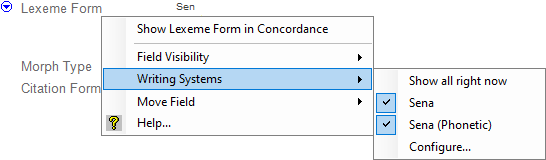
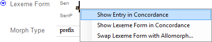
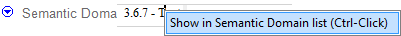
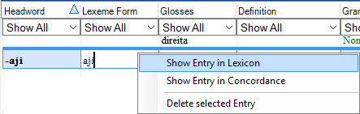
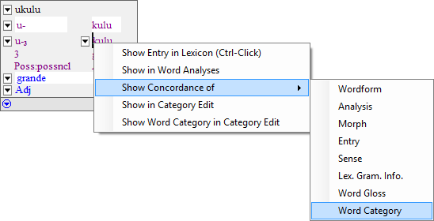
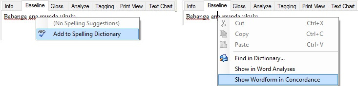

# Context sensitive menus

*Basic Tasks › Show data*

*Context-sensitive* menus are those that appear in response to user action (typically a mouse click) and whose contents are determined by the context (area, field, and so on).

There are *numerous* locations where you can right-click a [field](../../User_Interface/Field_Descriptions/field_descriptions_overview.md) label or data in a field, or the button on the [Information bar](../../User_Interface/Toolbars/information_bar_overview.md) to display a context-sensitive menu. Some menus commands have sub-menus. See also: [Move a field](../Moving_fields/Move_a_field.md).

## Examples (*not* exhaustive)

### Right-click a field label (or click its menu button )

### Right-click data in *some* text fields

### Right-click data in some list reference fields

### Right-click a row in a browse-style view

### Right-click (Gloss or Analyze tab. Try a Word is similar.)

The menu commands vary according to which line or item in the [word focus box](../../Using_Tools/Texts_&_Words_tools/Interlinear_Texts/Word_Focus_Box_examples.md) you right-click.

### Right-click in Before, Between and After boxes (Configure view)

For an example, see [About the Dictionary-Context style](../../User_Interface/Menus/Format/Styles/About_the_Dictionary-Context_style.md).

### Right-click anywhere spell checking occurs

This example shows two different menus that can appear on a word, here in a **Baseline** tab. The first picture shows a word [flagged](../Spell_Checking/Spell_checking_overview.md) with a wavy red underline. The second picture shows the same word, but without the spelling flag. (**Cut** and **Copy** are enabled when the word is selected.)

## Related topics
[List reference fields](../../User_Interface/Field_Descriptions/Field_Types/List_reference_field.md)

[Move a field](../Moving_fields/Move_a_field.md)

[Show data overview](Show_data_overview.md)

[Specify concordance criteria](../../Using_Tools/Texts_%26_Words_tools/Concordance/specify_concordance_criteria.md)
