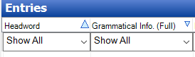

# Sort data

*Basic Tasks › Sorting data*

1.  If necessary, use the [Configure Columns](../Configure_Columns/Configure_Columns_overview.md) dialog box to show, hide, or add columns in the displayed view.

2.  In the column on which you want to sort the displayed data, do one or more of the following:

    - Click a column header to sort *all* the displayed data according to the data in that column.

      A triangle appears in the header, indicating the *primary* sort.

    - Click the column header *again* to reverse the sort (ascending versus descending).

      The triangle flips to indicate the opposite *primary* sort direction. Other sort options, described below, are maintained.

    - Press `Shift` and then click a column header of a column other than the one used to set the primary sort order, to provide a *secondary* sort.

      A triangle, *smaller* that the one that indicates the primary sort, appears indicating the secondary sort. Similarly, a *yet smaller* triangle indicates a tertiary sort.

    - Press `Shift` and then click a column header of the column that has the secondary sort *again* to reverse that *secondary* sort (ascending versus descending).

      The smaller triangle flips to indicate the opposite sort direction. Other sort options are maintained.

      The triangles look like this: 

    - *Right-click* a column header that is currently used for the primary or secondary sort, and then select the **Sorted** **From End** check box to sort starting at the end of the words rather than from the beginning.

      The justification of the content in that column reverses to indicate that the data is now sorted from the end. (This feature can be very useful, for example, to help expose occurrences of suffixes.)

    - *Right-click* a column header that is currently used for the primary or secondary sort, and then, if permitted by the column, select **Sorted By Length**. If desired, you can then click the column header to reverse the sort (ascending versus descending) as described above.

    - *Right-click* the column heading, and then clear the **Sorted From End** and **Sorted By Length** check box to sort alphabetically from the beginning of the words.

> [!TIP]
>
> - You can [filter](../Filtering_data/filtering_data_overview.md) and sort data simultaneously.
>
> These affect the contents and sort order in the **Dictionary** [view](../../Using_Tools/Lexicon_tools/Dictionary/Dictionary_overview.md).
>
> - The *secondary* sort capability is *not* to be confused with the ability to [change the secondary order](../../Using_Tools/Lists_tools/Change_the_secondary_sort_order.md) or to [set the primary sort order](../../Advanced_Tasks/Writing_Systems/Modifying_a_Writing_System/Writing_System_Properties_Sorting_tab.md) of dictionary entries.
>
> - The **Date Modified** time stamp is changed for all entries in a lexical relation or cross reference when you change the members. See [Date field](../../User_Interface/Field_Descriptions/Field_Types/date_field.md) for more information.
>
> - When sorting on a column in which some rows contain multiple items, the sorted data is displayed as one item for each row. This increases the total number of rows.

## Related topics
[Sorting data overview](Sorting_data_overview.md)

[Sort Grammar data](Sort_Grammar_data.md)

[Sort lexical entries](Sort_lexical_entries.md)

[Sort Texts & Words](Sort_Texts_Words.md)
