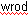

# Spell Checking overview

*Basic Tasks › Spell Checking*

Red wavy underlines *flag* possible spelling errors like this example: .

- For some writing systems (typically *analysis)*, spellings are compared to spelling dictionaries [files](dictionary_files.md) that you [obtained](Obtaining_spelling_dictionary_files.md) and [copied](Copy_spelling_dictionary_files.md) to your computer.

- For other writing systems (typically *default* *vernacular*), spellings are compared to vernacular spelling dictionaries added by FieldWorks, and typically populated by users working in the particular language project.

Checking is automatic in fields that permit it for each writing system with a [selected](../../Advanced_Tasks/Writing_Systems/Modifying_a_Writing_System/Writing_System_Properties_General_tab.md) spelling dictionary.

- Most [single-line](../../User_Interface/Field_Descriptions/Field_Types/Single_line_text_field.md) and [multi-paragraph](../../User_Interface/Field_Descriptions/Field_Types/Multiparagraph_text_field.md) text fields are checked. [List reference fields](../../User_Interface/Field_Descriptions/Field_Types/List_reference_field.md) are *not* checked, but [Lists](../../User_Interface/Field_Descriptions/Lists/Lists_fields_overview.md) or [Grammar](../../User_Interface/Field_Descriptions/Grammar/Grammar_fields_overview.md) fields are checked (where items are stored).

- In [Interlinear Texts](../../Using_Tools/Texts_&_Words_tools/Interlinear_Texts/texts_edit_overview.md), the **Baseline** tab content is checked (except [included](../Filtering_data/Choose_Texts.md) texts). **Info** tab contents and some [word focus box](../../Using_Tools/Texts_&_Words_tools/Interlinear_Texts/Word_Focus_Box_examples.md) lines are checked.

- No flags are displayed in non-editable views, such as **Dictionary** or **Document**.

## Things you can do

- Enable the features:

  - [Obtain](Obtaining_spelling_dictionary_files.md) and [copy](Copy_spelling_dictionary_files.md) the necessary [files](dictionary_files.md).

  - [Select](../../Advanced_Tasks/Writing_Systems/Modifying_a_Writing_System/Writing_System_Properties_General_tab.md) a spelling dictionary for a writing system.

- Use the features:

  - [Spell Checking vernacular words](vernacular_spell_checking.md).

  - In columns, use the **Spelling Errors** [filter](../Filtering_data/filtering_data_overview.md).

  - Right-click a flagged word, and then click the spelling alternative you want, **Other Suggestions** or **Add to Spelling Dictionary**.

    *Before* you click **Add to Spelling Dictionary**, look at the [Format](../../User_Interface/Toolbars/Format_toolbar.md) toolbar and make sure the *correct writing system* was used for the flagged word. The writing system determines which spelling dictionary receives the spelling. (If the orthography and **Normal** [style](../../User_Interface/Menus/Format/Styles/Styles_overview.md) are similar, the writing system may not be obvious.)

    [Selecting the correct writing system](../../User_Interface/Menus/Format/select_a_writing_system.md) may remove the flag.

> [!IMPORTANT]
>
> - This is a change of behavior from FieldWorks 6.0.X versions. It will also affect adding words to major language dictionaries.
>
> - - For example, even in English, if you tell it that `abc` is correct (for some reason), `Abc` will *not* be considered correct, even at the start of a sentence. (Our spelling-checker does not currently have the ability to take the sentence-initial position into account at all.) You may consequently see squiggles appear in unchanged texts that were previously considered all correct.

> [!NOTE]
>
> - **See:** <a href="https://software.sil.org/fieldworks/download/spelling-dictionaries/" target="_blank" title="https://software.sil.org/fieldworks/download/spelling-dictionaries/">https://software.sil.org/fieldworks/download/spelling-dictionaries/</a>

## Related topics
[About Hunspell](About_Hunspell.md)

[About spelling dictionary files](dictionary_files.md)

[Basic Tasks overview](../Basic_Tasks_overview.md)

[Change spelling overview](../../Using_Tools/Texts_&_Words_tools/Word_Analyses/Change_Spelling/change_spelling_overview.md)

[Spell Checking vernacular words](vernacular_spell_checking.md)

[Using the Writing System Properties dialog box](../../Advanced_Tasks/Writing_Systems/Modifying_a_Writing_System/Using_the_Writing_System_Properties_dialog_box.md)

[Words Analyses overview](../../Using_Tools/Texts_&_Words_tools/Word_Analyses/Word_Analyses_overview.md)
