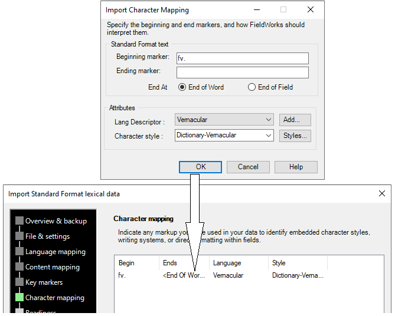

# Import Character Mapping sample

*Beginning Tasks › Importing Data*

This is a simple sample of how this dialog box can populate the **Character mapping** table.

## Related topics
[Import Character Mapping dialog box](import_character_mapping_dlg_box.md)

[Import Standard Format Lexical data](Import_Standard_Format_lexical_data.md)

[Step 6 of 8: Character Mapping](Step_6_of_8_Character_mapping.md)
