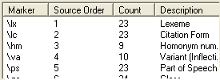

# Step 4 of 8: Content mapping

*Beginning Tasks › Importing Data*

1.  In the **Content mapping** area, for each marker for which you need to change or add a mapping, click the row for that marker, and then click **Modify**.

    The [Modify Mapping](modify_mapping_dialog_box.md) dialog box appears.

2.  When each marker is mapped (or, if applicable, **Exclude from import** is selected), click **Next**.

    [Step 5 of 8: Key markers](Step_5_of_8_Key_markers.md) appears.

> [!IMPORTANT]
>
> - Items with a red or blue font are those items for which something is unknown or set to be ignored, during the import.
>
> - If the marker you modified continues to have a colored background after you close the **Modify mapping** dialog box, it is possible that the writing system for the selected **Language Descriptor** is set to ignore in [Step 3 of 8](Step_3_of_8_Language_mapping.md).

> [!TIP]
>
> - You can click **Save** to save any changes you have made in any of the wizard's steps.
>
> - The second column from the left end, called **Source Order**, is normally hidden. If you need to see it, and possibly sort the data on that column, click and drag the column heading dividing lines to show it.
>
>   

## Related topics
[Import Standard Format Lexical data](Import_Standard_Format_lexical_data.md)
