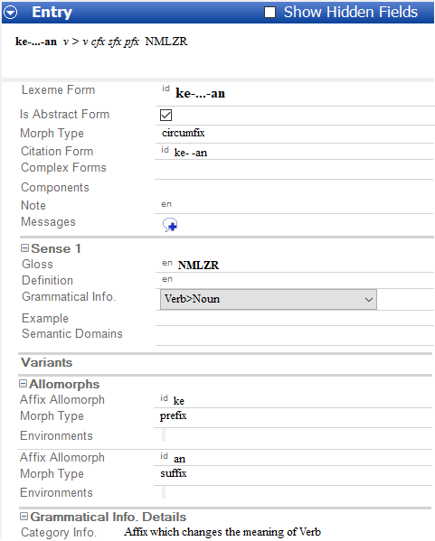
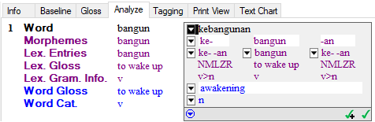

# Circumfix Example screen shot

*Morphology and Parsing Tasks*

These screen shots show the *initial* results from completing the example in the topic [Circumfix Example](circumfix_example.md).

- Here is a screen shot of the lexical entry ([Lexicon](../Using_Tools/Lexicon_tools/Lexicon_Edit/lexicon_edit_overview.md)):

  

<!-- -->

- Here is a screen shot of the interlinearized word ([Interlinear Texts](../Using_Tools/Texts_&_Words_tools/Interlinear_Texts/texts_edit_overview.md)):

  

> [!TIP]
>
> - For more information, point to **Resources** on the [Help](../User_Interface/Menus/Help/Help_overview.md) menu, and then click **Introduction to Parsing**. Circumfixes are discussed under **Lexical Entry Considerations**.

## Related topics
[Circumfix Example](circumfix_example.md)

[Morphology and Parsing overview](Morphology_Parsing_Tasks_overview.md)
