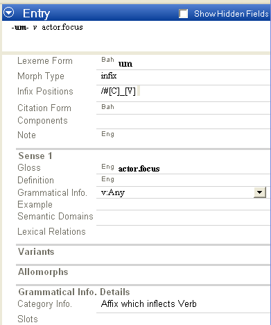
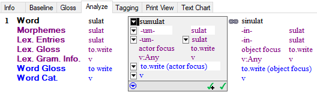

# Infix Example screen shot

*Morphology and Parsing Tasks*

The following screen shots show the *initial* results from completing the example in the topic [Infix Example](Infix_Example.md).

- Here is a screen shot of the lexical entry ([Lexicon](../Using_Tools/Lexicon_tools/Lexicon_Edit/lexicon_edit_overview.md)) for the actor focus infix `–um-` (the object focus infix `–in-` would be similar):

  

- Here is a screen shot of the interlinearized words ([Interlinear Texts](../Using_Tools/Texts_&_Words_tools/Interlinear_Texts/texts_edit_overview.md)), starting with the stem (`sulat`), and then the stem with the infixes (`sumulat` and `sinulat`):

> [!TIP]
>
> - To separate an infix from a stem in the **Morphemes** line, you need to select and cut (`Ctrl+X`) the infix, and then paste (`Ctrl+V`) it in front of the stem. Then, *manually* edit the infix and stem as needed to add the [tokens](../User_Interface/Field_Descriptions/Lists/Morpheme_Types_fields/Morpheme_Types_fields_overview.md) and ensure correct spellings
>
> - For more information, point to **Resources** on the [Help](../User_Interface/Menus/Help/Help_overview.md) menu, and then click **Introduction to Parsing**. Infixation is discussed under **Morphophonemics**.

## Related topics
[Circumfix Example](circumfix_example.md)

[Morphology and Parsing overview](Morphology_Parsing_Tasks_overview.md)
