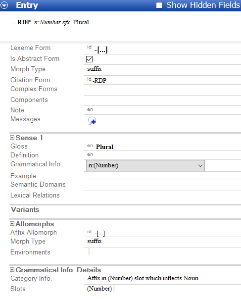
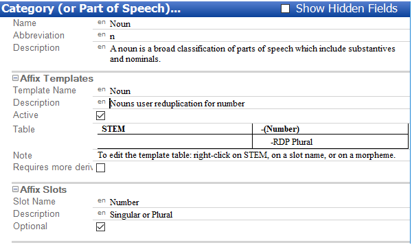
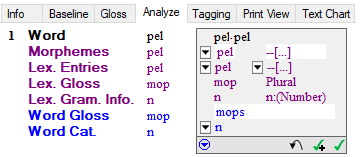
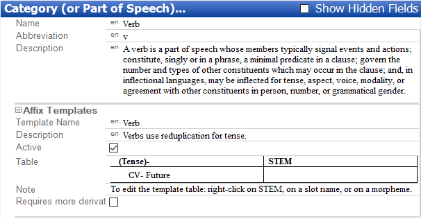
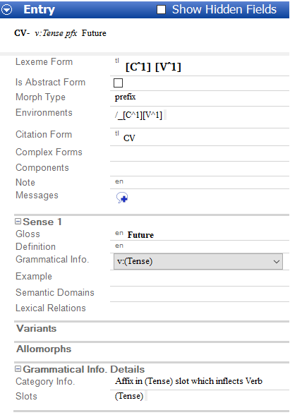
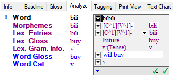

# Reduplication Examples screen shots

*Morphology and Parsing Tasks*

The following screen shots show the results from completing the examples in the topic [Reduplication Examples](reduplication_examples.md).

## Full Reduplication - Example 1

Here is a screen shot of the lexical entry ([Lexicon](../Using_Tools/Lexicon_tools/Lexicon_Edit/lexicon_edit_overview.md)):

- Here is a screen shot of the affix template table and slot ([Grammar](../Using_Tools/Grammar_tools/Category_Edit/Category_Edit_overview.md)):

  

- Here is a screen shot of the interlinearized word ([Interlinear Texts](../Using_Tools/Texts_&_Words_tools/Interlinear_Texts/texts_edit_overview.md)):

  

## Partial Reduplication - Example 2

- Here is a screen shot of the affix template table and slot ([Grammar](../Using_Tools/Grammar_tools/Category_Edit/Category_Edit_overview.md)):

  

- Here is a screen shot of the lexical entry ([Lexicon](../Using_Tools/Lexicon_tools/Lexicon_Edit/lexicon_edit_overview.md)):

- Here is a screen shot of the interlinearized word ([Interlinear Texts](../Using_Tools/Texts_%26_Words_tools/Interlinear_Texts/texts_edit_overview.md)):

  

> [!TIP]
>
> - For more information, point to **Resources** on the [Help](../User_Interface/Menus/Help/Help_overview.md) menu, and then click **Introduction to Parsing**. Reduplication is discussed under **Morphophonemics**.

## Related topics
[Reduplication Examples](reduplication_examples.md)

[Morphology and Parsing Tasks overview](Morphology_Parsing_Tasks_overview.md)
