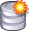

# Language Explorer dialog box

*Overview*

1.  Double-click the FieldWorks desktop icon ().

The  **Language Explorer** dialog box opens.

2.  Click one of these options:

|  |  |
|----|----|
| **Click** | **To** |
| **Open the last project** link | open the last project you edited |
| ** Open a project** | [open](../User_Interface/Menus/File/Open_a_language_project.md) the **Open Project** dialog box |
| ** Get project from a colleague** | [get a project](../User_Interface/Menus/Send_Receive/Get_a_project.md) |
| ** Create a new project** | [open](../User_Interface/Menus/File/Create_a_new_Fieldworks_project.md) the **New FieldWorks Project** dialog box |
| ** Import Standard Format data into a new project** | [open](../User_Interface/Menus/File/Create_a_new_Fieldworks_project.md) the **New FieldWorks Project** dialog box, *and then* [open](../Beginning_Tasks/Importing_Data/Import_Standard_Format_lexical_data.md) the **Import Standard Format lexical data** dialog box. |
| ** Restore a project from a backup file** | [restore a project](../User_Interface/Menus/File/Backup_and_Restore/Restore_a_project.md) |

3.  Select () the check box if you want to automatically open the *last* project that was *changed* each time you start FieldWorks.

**Note:** The **Options** [dialog box](../User_Interface/Menus/Tools/Options/Options_overview.md) has another instance of this check box.

4.  If you do not want to use FieldWorks, click **Close**.

> [!IMPORTANT]
>
> - By default, anonymous usage statistics are sent to developers.
>
> If you want to disable this, click **Options** and then clear () the check box on the **Privacy** [tab](../User_Interface/Menus/Tools/Options/Options_overview.md).
>
> **See Also**: <a href="https://software.sil.org/language-software-privacy-policy/" target="_blank" title="https://software.sil.org/language-software-privacy-policy/">https://software.sil.org/language-software-privacy-policy/</a>
>
> - By default, for Windows® computers, some updates are automatically downloaded to your computer.
>
> To change download options, click **Options** and then use the **Updates** [tab](../User_Interface/Menus/Tools/Options/Options_overview.md).
>
> If selected (), you will be informed when an update has been downloaded. You will be asked to restart FieldWorks to install it. Then, you will be asked if you want to install now.

## Related topics
[Collection of Locale Data](../Advanced_Tasks/Writing_Systems/Modifying_a_Writing_System/Collection_of_Locale_data.md)

[Create Shortcut on Desktop](../User_Interface/Menus/File/Create_Shortcut_on_Desktop.md)

[File menu overview](../User_Interface/Menus/File/File_overview.md)

[Getting started](Getting_started.md)

[Help menu overview](../User_Interface/Menus/Help/Help_overview.md)

[Options overview](../User_Interface/Menus/Tools/Options/Options_overview.md)

[Unable to Open Project dialog box](../User_Interface/Menus/File/Unable_to_Open_Project.md)
