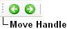

# Move a toolbar

*User Interface › Changing toolbars and menus*

-- This feature is currently disabled--

- Click the *move handle* on the toolbar you want to move, and then drag the toolbar to the desired location. Release the mouse button where you want the toolbar.

### Example

## Related topics
[Changing toolbars and menus](Changing_toolbars_and%20menus_overview.md)

[Restore default settings](../Menus/Tools/Restore_defaults.md)
