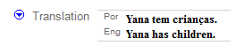
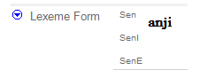

# Single-line text field example graphic

*User Interface › Field Descriptions › Field Types*

In this example of the FLEx User Interface (UI), the **Translation** field uses two analysis writing system lines, **Por** (Portuguese) and **Eng** (English).

> [!NOTE]
>
> - You can [use](../../../Advanced_Tasks/Writing_Systems/Modifying_a_Writing_System/Using_the_Writing_System_Properties_dialog_box.md) the **Writing System Properties** dialog box to [edit](../../../Advanced_Tasks/Writing_Systems/Modifying_a_Writing_System/Writing_System_Properties_General_tab.md) the abbreviation.
>
> - Abbreviations are particularly important for [phonetic and phonemic](../../../Advanced_Tasks/Writing_Systems/Add_a_new_writing_system/Add_a_new_writing_system.md) writing systems to distinguish them from the orthographic writing system. For example:
>
> 

## Related topics
[Configure writing systems for fields](../../../Basic_Tasks/Showing_Writing_Systems/configure_field_WSs.md)

[Reversal Entries field](../Lexicon/Lexicon_Edit_fields/Sense_level_fields/reversal_entries_field.md) (**Lexicon Edit**)

[Single-line text field](Single_line_text_field.md)

[Select a writing system](../../Menus/Format/select_a_writing_system.md)

[Writing system codes](../../../Advanced_Tasks/Writing_Systems/Add_a_new_writing_system/Writing_system_codes.md)
