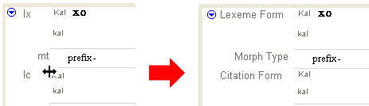
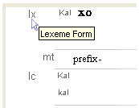

# Change the width of the field label area

*User Interface › Field Descriptions › Field Types*

You can change the width of the area that contains field labels (names). Full names, abbreviations or truncated names appear. As the width is reduced, the abbreviation that reflects the standard format markers from the *Multi-Dictionary Formatter* (MDF) concept is used, if available. Otherwise, the name is truncated.

1.  Move the mouse pointer to the area to the right of the field labels, between the ends of the lines that separate fields.

    The mouse pointer becomes a vertical line with outward-pointing arrows.

2.  Click and hold the mouse button down while you drag the mouse pointer to the left or right, then release the mouse button.

3.  Repeat the above steps, as necessary.

### **Example**

- Hover the mouse pointer over a field label to see the full name in a popup box:

## Related topics
[Field Descriptions overview](../field_descriptions_overview.md)

[Field Types overview](field_types_overview.md)
