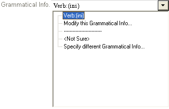

# Down arrow with open list example graphic

*User Interface › Field Descriptions › Field Types*

The example below shows a [list reference field](List_reference_field.md) that uses a down arrow () to access a list (the list is shown displayed).

In the above example, you can choose any of the following from the list:

- Actual grammatical information, here **Verb:(ini)**.

- **\<Not Sure\>** to specify that you are not sure and that you want this field to indicate that fact.

- **Modify this Grammatical Info** or **Specify different Grammatical Info**. These open a dialog box so you can make appropriate changes.

In other contexts, there may be different list items, but they work in a similar way.

## Related topics
[Field Types overview](field_types_overview.md)

[Shortcut keys overview](../../Shortcuts/shortcut_keys_overview.md)
