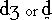

# IPA Symbol field (Phonemes)

*User Interface › Field Descriptions › Grammar › Phonemes fields*

**Full name:** **IPA Symbol**

**Location:** **Phoneme** pane of **Phonemes** ([Grammar](../../../../Using_Tools/Grammar_tools/grammar_overview.md))

**Description:**

This field stores the basic IPA symbol for the phoneme.

When you enter (type or paste) an IPA character in this field, the following happen:

- If the [Description field](description_field_phonemes.md) is empty, FieldWorks inserts a description from the IPA character inventory and catalog data (included with FieldWorks).\
  Fields with existing descriptions are *not* changed.

- If the [Phonological Features field](Phonological_Features_field.md) is empty *and* you have [inserted](../../../../Using_Tools/Grammar_tools/Phonological_Features/Insert_a_phonological_feature.md) phonological features from the **Add Phonological Feature from Catalog**, then FieldWorks inserts appropriate phonological features (those it knows about and that match the catalog identification (hidden metadata)).

Fields with existing content (description or phonological features) are *not* changed.

**Prerequisites:**

Before you type in this field, you need to do the following:

1.  [Add a phonetic writing system](../../../../Advanced_Tasks/Writing_Systems/Add_a_new_writing_system/Add_a_new_writing_system.md), if one is not already defined in this project.

2.  Manually [select](../../../Menus/Format/select_a_writing_system.md) the IPA writing system on the **Format** [toolbar](../../../Toolbars/Format_toolbar.md) or [menu](../../../Menus/Format/Format_overview.md). An IPA writing system has "**(Phonetic)**" at the end of its name.

**Tasks:**

- [Insert a phoneme](../../../../Using_Tools/Grammar_tools/Phonemes/Insert_a_phoneme.md)

  - [Edit a phoneme](../../../../Using_Tools/Grammar_tools/Phonemes/Edit_a_phoneme.md)

- **See also:** [Phonemes overview](../../../../Using_Tools/Grammar_tools/Phonemes/Phonemes_overview.md)

**Field type:** [Special text field](../../Field_Types/Single_line_text_field.md)

**Writing systems:** A [vernacular](../../../../Advanced_Tasks/Writing_Systems/Add_a_new_writing_system/About_Writing_Systems.md) writing system that you have defined to store the IPA (International Phonetic Alphabet) representations of the vernacular language. See **** **Known Issues** below.

**Grammar Sketch:** Under **Phonemes**

**Known issue:**

Some IPA characters that are composites, such as , do not fully generate the description and phonological feature as described above.

Currently, you can type part of the symbol to generate them, and then edit the description or [choose features and values](../../../../Using_Tools/Grammar_tools/Phonemes/Choose_phonological_features.md) as needed. Then finish adding the rest of the symbol to this field.

## Related topics
[Grammar Sketch](../../../../Using_Tools/Grammar_tools/Grammar_Sketch/Grammar_Sketch_overview.md)

[Phonemes fields overview](Phonemes_fields_overview.md)

## Related links
<a href="https://software.sil.org/fonts/guides/" target="_blank" title="https://software.sil.org/fonts/guides/">https://software.sil.org/fonts/guides/</a>
