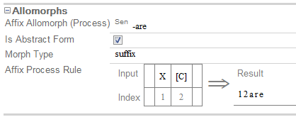

# Affix Process Rule field (Affix Process Rule fldAF)

*User Interface › Field Descriptions › Lexicon › Lexicon Edit fields › Allomorphs level fields*

**Full name:** **Affix Process Rule**

**Location:**

In the **Entry** pane (**Lexicon Edit**).

This field is at the [Allomorphs-level](Alt_Forms_lev_flds_ov.md).

(A separate **Affix Process Rule** [field](../Entry_level_fields/Affix_Process_Rule_field.md) can appear between the **Lexeme Form** [field](../Entry_level_fields/Lexeme_Form_field.md) and the **Sense 1** [field](../Sense_level_fields/Sense_field.md). It refers to the lexeme form, not the entire entry.)

**Description:**

This field stores a rule table, a list of **Insert options**, and a **Result** line. The list of **Insert options** changes, depending on where you click in the table. If you click an option, an item is inserted into the table. Some options open a dialog box so you can choose a particular item.

**Tasks:**

- [Build an Affix Process Rule](../../../../../Using_Tools/Lexicon_tools/Lexicon_Edit/Build_Affix_Process_Rule.md)

- [Convert an existing Allomorph into an Affix Process](../../../../../Using_Tools/Lexicon_tools/Lexicon_Edit/Convert_existing_form_or_allomorph.md)

- [Insert an Affix Process](../../../../../Using_Tools/Lexicon_tools/Lexicon_Edit/Insert_Affix_Process_Rule.md)

**Field type:** Table

**Writing systems:** default [analysis](../../../../../Advanced_Tasks/Writing_Systems/Add_a_new_writing_system/About_Writing_Systems.md)

**Note:**

- You can [convert](../../../../../Using_Tools/Lexicon_tools/Lexicon_Edit/Convert_existing_form_or_allomorph.md) an Affix Process allomorph back to a regular affix allomorph.

- You can have a mix of process forms and regular forms in a lexical entry.

**Example:**

Suppose you had a suffix where the lexeme form was "*re"*, and the allomorph was "*are"* when following a consonant. You could represent the process like this:

Another example is offered in [Affix Process Rule Examples](../Entry_level_fields/Affix_Process_Rules_Examples.md).

- For more information, point to **Resources** on the [Help](../../../../Menus/Help/Help_overview.md) menu, and then click **Introduction to Parsing**. Affix Process rules are discussed under **Item and Process**.

## Related topics
[Lexicon Edit fields overview](../Lexicon_Edit_fields_overview.md)

[Lexicon Edit overview](../../../../../Using_Tools/Lexicon_tools/Lexicon_Edit/lexicon_edit_overview.md)

[Parsing words overview](../../../../Menus/Parser/Parsing_words_overview.md)

[Show data overview](../../../../../Basic_Tasks/Show_data/Show_data_overview.md)
