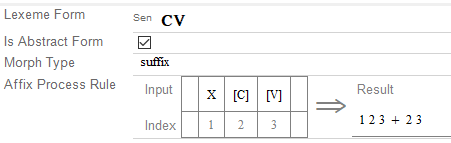

# Affix Process Rule field (Affix Process Rule field)

*User Interface › Field Descriptions › Lexicon › Lexicon Edit fields › Entry level fields*

**Full name:** **Affix Process Rule**

**Location:**

In the **Entry** pane (**Lexicon Edit**).

This field is between the **Lexeme Form** [field](Lexeme_Form_field.md) and the **Sense 1** [field](../Sense_level_fields/Sense_field.md). It refers to the lexeme form, not the entire entry.

(One or more separate **Affix Process Rule** [fields](../Alternate_Forms_level_flds/Affix_Process_Rule_fldAF.md) can appear at the [Allomorphs level](../Alternate_Forms_level_flds/Alt_Forms_lev_flds_ov.md).)

**Description:** This field stores a rule table, a list of **Insert options**, and a **Result** line. The list of **Insert options** changes, depending on where you click in the table. If you click an option, an item is inserted into the table. Some options open a dialog box so you can choose a particular item.

**Tasks:**

- [Build an Affix Process Rule](../../../../../Using_Tools/Lexicon_tools/Lexicon_Edit/Build_Affix_Process_Rule.md)

- [Convert an existing form into an Affix Process](../../../../../Using_Tools/Lexicon_tools/Lexicon_Edit/Convert_existing_form_or_allomorph.md)

**Field type:** Table

**Writing systems:** default [analysis](../../../../../Advanced_Tasks/Writing_Systems/Add_a_new_writing_system/About_Writing_Systems.md)

**Note:**

- You can [convert](../../../../../Using_Tools/Lexicon_tools/Lexicon_Edit/Convert_existing_form_or_allomorph.md) an Affix Process form back to a regular affix form.

- You can have a mix of process forms and regular forms in a lexical entry.

**Example:**

Suppose you had a suffix that reduplicated the final syllable of the noun stem to signify PLURAL. You could represent the process like this:

**:**

Another example is offered in [Affix Process Rule Examples](Affix_Process_Rules_Examples.md).

- For more information, point to **Resources** on the [Help](../../../../Menus/Help/Help_overview.md) menu, and then click **Introduction to Parsing**. Affix process rules are discussed under **Item and Process**.

## Related topics
[Entry-level fields overview](Entry_level_fields_overview.md)

[Circumfix Example screen shot](../../../../../Morphology_and_Parsing_Tasks/Circumfix_example_screen_shot.md)

[Lexicon Edit overview](../../../../../Using_Tools/Lexicon_tools/Lexicon_Edit/lexicon_edit_overview.md)

[Show data overview](../../../../../Basic_Tasks/Show_data/Show_data_overview.md)
