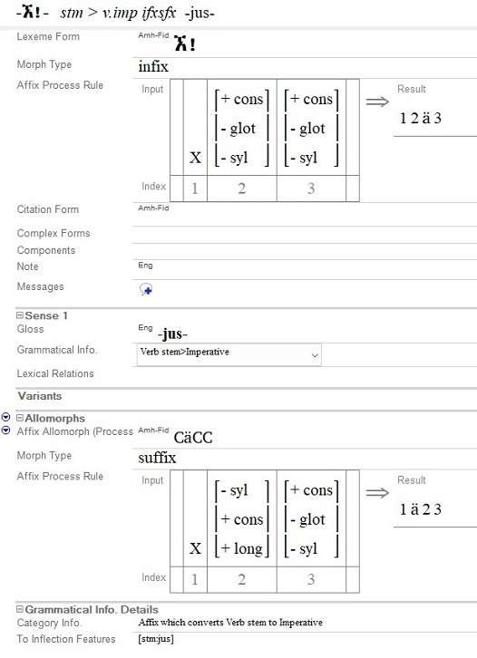

# Affix Process Rules Examples

*User Interface › Field Descriptions › Lexicon › Lexicon Edit fields › Allomorphs level fields*

In Lexicon Edit, a project can have an **Affix Process Rule** [field](Affix_Process_Rule_field.md) that is associated with the Lexeme Form, and one or more **Affix Process Rule** [fields](../Alternate_Forms_level_flds/Affix_Process_Rule_fldAF.md) below the **Allomorphs** [field](../Alternate_Forms_level_flds/Alternate_Forms_fld.md). Here is another example of a process rule.

- The lexeme takes a tri-consonantal verb stem and inserts the vowel /ä/ (a schwa, or \[ə\]), between the ultimate and the penultimate of the three root consonants to create an imperative/jussive verb stem.

- The allomorph places the same vowel between the first and the second of the three root consonants, if the second root consonant is lengthened. This morpheme, therefore, takes care of the Amharic imperative/jussive stem formation. Amharic is a Semitic language spoken in Ethiopia, and it is characterized by the so-called non-concatenative morphology that is found in all Semitic languages.

> [!NOTE]
>
> A much-simplified explanation might be stated something like this:
>
> - On roots consisting of 3 consecutive consonants, if the middle one is long, insert an ä vowel before the long consonant, otherwise insert an ä vowel between the last 2 consonants.
>
> - Allomorphs are generally exception rules that are tried first, and if none match, then default to the rule in the lexeme form.

###  Related Topics

[Lexicon Edit overview](../../../../../Using_Tools/Lexicon_tools/Lexicon_Edit/lexicon_edit_overview.md)
