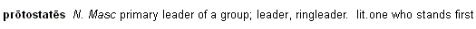

# Literal Meaning field

*User Interface › Field Descriptions › Lexicon › Lexicon Edit fields › Entry level fields*

**Full name:** **Literal Meaning**

**Abbreviation:** **lt**

**Location:**

In the **Entry** pane (**Lexicon Edit**).

This field is between the **Lexeme Form** [field](Lexeme_Form_field.md) and the **Sense 1** [field](../Sense_level_fields/Sense_field.md), at the [entry level](Entry_level_fields_overview.md).

**Description:**

This field stores a literal meaning of the headword ([Lexeme Form](Lexeme_Form_field.md) or [Citation Form](Citation_Form_field.md)).

Typically, this field is necessary only for a compound or an idiom where the meaning of the whole is different from the sum of its parts. See **Example** below.

**Tasks:**

- [Enter a literal meaning](../../../../../Using_Tools/Lexicon_tools/Lexicon_Edit/Enter_a_literal_meaning.md)

- You can [configure the dictionary](../../../../Menus/Tools/Configure_Dictionary/Configure_Dictionary.md) to include the literal meaning when you configure [Literal Meaning](../../../../Menus/Tools/Configure_Dictionary/Literal_Meaning.md).

**Field type:** [Single-line text field](../../../Field_Types/Single_line_text_field.md) — allows embedded [writing systems](../../../../Menus/Format/select_a_writing_system.md) and [styles](../../../../Menus/Format/apply_a_style_to_text.md)

**Writing systems:** One or more [analysis](../../../../../Advanced_Tasks/Writing_Systems/Add_a_new_writing_system/About_Writing_Systems.md)

## Example

The example word (transliterated Koine Greek) is formed as follows:

`Proto` *first in time or place, or first in rank*; `sta` *to stand*; `tes` *one who*.

It is often translated as *leader* or *ringleader*, but literally means *one who stands first*.

## Related topics
[Entry-level fields overview](Entry_level_fields_overview.md)

[Lexicon Edit overview](../../../../../Using_Tools/Lexicon_tools/Lexicon_Edit/lexicon_edit_overview.md)

[Summary Definition field](Summary_Definition_field.md)
