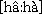
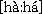

# Tone field

*User Interface › Field Descriptions › Lexicon › Lexicon Edit fields › Entry level fields*

**Full name:** **Tone**

**Abbreviation:** **tn**

**Location:**

In the **Entry** pane (**Lexicon Edit**).

This field is between the **Lexeme Form** [field](Lexeme_Form_field.md) and the **Sense 1** [field](../Sense_level_fields/Sense_field.md), at the [entry level](Entry_level_fields_overview.md).

Each time you insert a pronunciation, these fields appear: [Pronunciation](Pronunciation_field.md), [CV Pattern](cv_pattern_field.md), **Tone**, [Location](Location_field.md) and [Publish Pronunciation In](Publish_In_(Pronunciations).md).

**Tasks:**

- [Enter a pronunciation](../../../../../Using_Tools/Lexicon_tools/Lexicon_Edit/Enter_a_Pronunciation.md)

- [Insert a pronunciation](../../../../../Using_Tools/Lexicon_tools/Lexicon_Edit/Insert_a_pronunciation.md)

- You can [configure the dictionary](../../../../Menus/Tools/Configure_Dictionary/Configure_Dictionary.md) to include the **Tone** field content when you configure [Pronunciations](../../../../Menus/Tools/Configure_Dictionary/Pronunciations.md).

**Field type:** [Single-line text](../../../Field_Types/Single_line_text_field.md) — allows [embedding](../../../../Menus/Format/select_a_writing_system.md) styles and writing systems

**Writing systems:** One or more [analysis](../../../../../Advanced_Tasks/Writing_Systems/Add_a_new_writing_system/About_Writing_Systems.md)

**Discussion:**

If your language has lexical tone or stress, you can enter a representation of the tone or stress pattern into the **Tone** field. It was designed as an analysis field to enable you to analyze the tone or stress patterns of words. However you can configure the dictionary to display the **Tone** field contents in the [Dictionary](../../../../../Using_Tools/Lexicon_tools/Dictionary/Dictionary_overview.md). For example, if the orthography of your language does *not* mark tone or stress, you can use the **Tone** field to indicate the tone or stress pattern of each lexeme in the dictionary.

If your language has lexical tone or stress, you need to determine a strategy for representing it in the dictionary. If it is marked in the orthography, it will be represented in the headword. However sometimes the orthographic representation does not accurately or completely represent the phonemic tones. In such cases the phonemic tones should be represented elsewhere.

If tone or stress are *not* marked in the orthography, there are three options:

1.  Indicate it in the [Lexeme Form](Lexeme_Form_field.md) field.

    However most lexicographers prefer to use the **Lexeme Form** field to indicate the orthographic spelling of the lexeme. So if the orthography does *not* mark tone or stress, this may not be a good option.

2.  Indicate it in the **Pronunciation** field.

    This is generally a good option.

3.  Indicate it in the **Tone** field.

    Since the **Tone** field was intended to be used for an abstract representation of the tone or stress pattern, you should determine if such an abstract representation is useful to your target audience.

In the **Tone** field, you can use any system of diacritics, numbers, or letters that you want to in order to represent the tone or stress pattern. However it is often difficult to see and interpret diacritics or IPA symbols. You may also have trouble getting them to sort properly. So most linguists use capital letters to represent the tone or stress on a syllable. You can use whatever symbols best capture the distinctions and aid in the analysis.

In order to get each unique tone pattern to sort separately in the Lugungu language of Uganda, the following system was used: Each syllable was separated by a period. High tone was symbolized with **H**, low tone with **L**, falling tone with **F**, and rising tone with **R**. Each *mora* (tone bearing unit) was given a separate letter. For example:

|  |  |  |  |
|----|----|----|----|
| Lexeme | Pronunciation | Tone | Gloss |
| haaha |  | HL.L | here |
| haaha |  | LL.H | grandfather |
| muto |  | L.H | soup |
| muto |  | L.F | youth |

In a stress language such as English you can symbolize primary stress with **P**, secondary stress with **S**, and unstressed with **U**. (If your language only has only *two levels*, you can use **S** for stressed and **U** for unstressed.) For example:

|  |  |  |  |
|----|----|----|----|
| Lexeme | Pronunciation | Tone | Gloss |
| insert |  | UP | put.in (verb) |
| insert |  | PU | sth.put.in (noun) |
| explanation |  | SUPS | description |

## Related topics
[Entry-level fields overview](Entry_level_fields_overview.md)

[Fill in the Tone field](../../../../../Lexicography_Tasks/Fill_in_the_Tone_Field.md) (**Bulk Edit**)

[Lexicon Edit overview](../../../../../Using_Tools/Lexicon_tools/Lexicon_Edit/lexicon_edit_overview.md)
