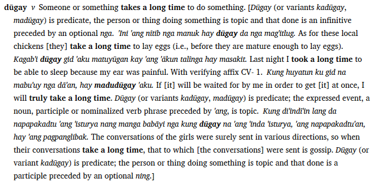

# Extended Note fields overview

*User Interface › Field Descriptions › Lexicon › Lexicon Edit fields › Sense level fields*

## Overview

At times it is useful to write a lengthy note with example sentences interspersed in the note. **Extended Note** fields provide this capability. Each extended note allows text followed by any number of examples. Each extended note also has a type. By adding contiguous extended notes of the same type, you can create these lengthy notes with begin/end punctuation surrounding the entire note.

You can [insert](../../../../../../Using_Tools/Lexicon_tools/Lexicon_Edit/Insert_an_extended_note.md) more than one extended note in a lexical entry. You can [insert](../../../../../../Using_Tools/Lexicon_tools/Lexicon_Edit/Insert_an_example_in_extended_note.md) more than one example in an extended note.

## Example

## Topics

- First, [insert an extended note](../../../../../../Using_Tools/Lexicon_tools/Lexicon_Edit/Insert_an_extended_note.md). Then the **Extended Note** [field](Extended_Note_field.md) becomes the  **Extended Note** *header* field.

These fields appear below it:

  - [Type](Type_field_(Extended_Note).md)

  - [Discussion](Discussion_field_(Extended_Note).md)

  - [Example](Example_field_(Extended_Note).md)

    - [Translation](Translation_field_(Extended_Note).md)

> [!TIP]
>
> - If you need to have different begin/end punctuation for different extended note [types](Type_field_(Extended_Note).md), you can do this by [duplicating](../../../../../Menus/Tools/Configure_Dictionary/Duplicate_Dict_field.md) the **Extended Note** node in [dictionary configuration](../../../../../Menus/Tools/Configure_Dictionary/Extended_Note.md).

## Related topics
[Enter extended note information](../../../../../../Using_Tools/Lexicon_tools/Lexicon_Edit/Enter_Extended_Note.md)

[Sense-level fields overview](../Sense_level_fields_overview.md)
