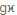
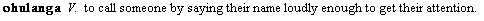
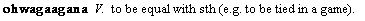

# Gloss field (Sense)

*User Interface › Field Descriptions › Lexicon › Lexicon Edit fields › Sense level fields*

**Full name:** **Gloss**

**Abbreviation:** 

**Location:**

In the **Entry** pane (**Lexicon Edit**).

This **Gloss** field is in each **[sense](Sense_level_fields_overview.md) and subsense.

(A separate [Gloss](../Entry_level_fields/Gloss_field_Etymology.md) field appears with the **Etymology** field at the [entry](../Entry_level_fields/Entry_level_fields_overview.md) level.)

**Description:** A *gloss* is a very short definition, usually only a single word.

**Tasks:**

- [Create a lexical entry](../../../../../Using_Tools/Lexicon_tools/Lexicon_Edit/Create_a_lexical_entry.md)

- [Change or enter a gloss](../../../../../Using_Tools/Lexicon_tools/Lexicon_Edit/Change_a_gloss_of_an_entry.md) (one at a time)

- [Fill in the Gloss field](../../../../../Lexicography_Tasks/Fill_in_the_Gloss_Field.md) (using **Bulk Edit Entries**)

- You can [configure the dictionary](../../../../Menus/Tools/Configure_Dictionary/Using_the_Configure_Dictionary_dialog_box.md) to display [Gloss](../../../../Menus/Tools/Configure_Dictionary/gloss.md) or [Definition (or Gloss)](../../../../Menus/Tools/Configure_Dictionary/Definition_or_Gloss.md).

**Field type:** [Single-line text field](../../../Field_Types/Single_line_text_field.md) – you *cannot* embed characters in other writing systems or embed styles

**Writing systems:** One or more [analysis](../../../../../Advanced_Tasks/Writing_Systems/Add_a_new_writing_system/About_Writing_Systems.md)

**Note:**

- This field is limited to 256 characters because glosses should be short.

  If a [merge](../../../../../Using_Tools/Lexicon_tools/Lexicon_Edit/Merge_senses.md) or a copy/paste operation results in more than 256 characters, the [Find Lexical Entry](../../../../Menus/Edit/Find_a_lexical_entry.md) dialog box becomes partially unable to display any entries for which that headword begins with the same character. You need to reduce the length of the gloss to correct this.

- Using this field, you can [click and drag](../../../../../Using_Tools/Lexicon_tools/Lexicon_Edit/Move_sense_to_another_entry.md) the current sense into another entry.

> [!IMPORTANT]
>
> The gloss field is used for several purposes. The primary purpose is to indicate the meaning of a stem or affix when interlinearizing a text. You might also want a very short indication of the meaning in a browse view.
>
> In an interlinear text, you want the gloss to be as short as possible. Consider the following entry from the *Lunyole* dictionary:
>
> 
>
> The best single word to capture the meaning of **ohulanga** would be *call*. So we would put *call* in the **Gloss** field.
>
> Sometimes you need two or more words for the gloss. FieldWorks allows you to use a space between words in a gloss. However, since some programs use a space to line up an interlinear display, it is customary to separate the words with periods. Consider the following entry:
>
> 
>
> There is no single word in English to capture the meaning of **ohwagaagana**. So *be.equal* would be the best gloss.
>
> If you have already given a definition for each word in your dictionary, you can use it as a basis for filling in the gloss field quickly. A procedure for doing this is described [Fill in the Gloss field](../../../../../Lexicography_Tasks/Fill_in_the_Gloss_Field.md).
>
> FieldWorks has a tool called the [Morphosyntactic Gloss Assistant](../../../../../Using_Tools/Lexicon_tools/Lexicon_Edit/Using_Morphosyntactic_Gloss_Assistant.md) to help you construct a gloss for an affix. It has a list of frequently occurring components and a short description of each to help you accurately label the meaning.

## Related topics
[Lexicon Edit overview](../../../../../Using_Tools/Lexicon_tools/Lexicon_Edit/lexicon_edit_overview.md)

[Sense-level fields overview](Sense_level_fields_overview.md)
