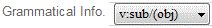
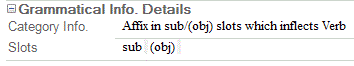

# Grammatical Info field

*User Interface › Field Descriptions › Lexicon › Lexicon Edit fields › Sense level fields*

**Full name:** **Grammatical Info.**

**Abbreviation:** **ps**

**Location:**

In the **Entry** pane (**Lexicon Edit**).

There is a **Grammatical Info** field in each **[sense](Sense_level_fields_overview.md) and subsense.

**Description:**

This field stores a summary of the grammatical information for this sense, such as category, inflection class, slot and maybe some inflection features:

- **\<Not Sure\>** appears for each entry that is *not* an affix and for which a grammatical category is not specified.

- **Any\>Any** appears for *derivational* affixes for which both the **Attaches to Category** and **Changes to Category** are set to **\<Any\>**.

- **Attaches to any category** appears for affixes whose type is **\<Not Sure\>** and for which **Attaches to Category** is set to **\<Any\>**.

- **Inflects any category** appears for *inflectional* affixes for which **Attaches to Category** is set to **\<Any\>**.

Additional details appear under [Grammatical Info Details](../Grammatical_Info_Details_fields/grammatical_info_details_field.md).

**Tasks:**

- [Change the Grammatical Info](../../../../../Using_Tools/Lexicon_tools/Lexicon_Edit/change_the_grammatical_info.md)

- You can [configure the dictionary](../../../../Menus/Tools/Configure_Dictionary/Configure_Dictionary.md) to show associated fields when you configure [Grammatical Info](../../../../Menus/Tools/Configure_Dictionary/Grammatical_Info.md).

**Field type:** [List reference](../../../Field_Types/List_reference_field.md) field

**Writing systems:** Best [analysis](../../../../../Advanced_Tasks/Writing_Systems/Add_a_new_writing_system/About_Writing_Systems.md)

###  Example

Here is a field in a lexical entry for an affix that inflects verbs.

The **v** is the category, verb; **sub** is the [name](../../../Grammar/Category_Edit_fields/name_field_slot_category_edit.md) of an *obligatory* slot; **(obj)** is the name of another slot marked as *optional*.

The corresponding **Grammatical Info** **Details** fields contain the following:

## Related topics
[Category Info field](../Grammatical_Info_Details_fields/Category_Info_field.md)

[Lexicon Edit overview](../../../../../Using_Tools/Lexicon_tools/Lexicon_Edit/lexicon_edit_overview.md)

[Sense-level fields overview](Sense_level_fields_overview.md)
