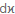

# Definition field

*User Interface › Field Descriptions › Lexicon › Lexicon Edit fields › Sense level fields*

**Full name:** **Definition**

**Abbreviation:** 

**Location:**

In the **Entry** pane (**Lexicon Edit**).

There is a **Definition** field in each **[sense](Sense_level_fields_overview.md) and subsense.

**Description:** This field stores the statement that expresses the meaning of the current sense of the headword ([Lexeme Form](../Entry_level_fields/Lexeme_Form_field.md) or [Citation Form](../Entry_level_fields/Citation_Form_field.md)).

**Tasks:**

- [Enter a definition](../../../../../Using_Tools/Lexicon_tools/Lexicon_Edit/enter_a_definition.md)

- You can [configure the dictionary](../../../../Menus/Tools/Configure_Dictionary/Using_the_Configure_Dictionary_dialog_box.md) to display [Definition](../../../../Menus/Tools/Configure_Dictionary/Definition.md) or [Definition (or Gloss)](../../../../Menus/Tools/Configure_Dictionary/Definition_or_Gloss.md).

**Field type:** [Single-line text field](../../../Field_Types/Single_line_text_field.md) — allows embedded [writing systems](../../../../Menus/Format/select_a_writing_system.md) and [styles](../../../../Menus/Format/apply_a_style_to_text.md). This field is limited to 4000 characters in each writing system. If you paste content that is larger, a message box appears and states how many characters were truncated from the pasted content.

**Writing systems:** One or more [analysis](../../../../../Advanced_Tasks/Writing_Systems/Add_a_new_writing_system/About_Writing_Systems.md)

## Related topics
[Change the morph type](../../../../../Using_Tools/Lexicon_tools/Lexicon_Edit/change_the_morph_type.md)

[Create a lexical entry](../../../../../Using_Tools/Lexicon_tools/Lexicon_Edit/Create_a_lexical_entry.md)

[Lexicon Edit overview](../../../../../Using_Tools/Lexicon_tools/Lexicon_Edit/lexicon_edit_overview.md)

[Sense-level fields overview](Sense_level_fields_overview.md)
