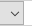

# Reference set type field (Lexical Relations)

*User Interface › Field Descriptions › Lists › Lexical Relations fields*

**Full name:** **Reference set type**

**Location:** **Lexical Relation** pane of the **Lexical Relations** list ([Lists](../../../../Using_Tools/Lists_tools/List_item_usage_table.md))

**Description:**

This field stores the reference set type for the current [named](name_field_lexical_relations.md) lexical relation.

This type selection determines the components and views resulting from the use of the lexical relation. For example, some types allow pairs, others [trees](../../../../Using_Tools/Lists_tools/Set_Type_example_sense_tree.md), others [sequences](../../../../Using_Tools/Lists_tools/Set_Type_example_entry_sequence_scale.md), and so on.

**See Also:** [About reference set types](../../../../Using_Tools/Lists_tools/About_reference_set_types.md) and [About Lexical Relations](../../../../Using_Tools/Lists_tools/About_Lexical_Relations.md).

**Tasks:**

- Click the down arrow , and then select a type from the list.

- [Edit a list item](../../../../Using_Tools/Lists_tools/Edit_a_list_item_or_subitem.md)

**Field type:** This is a list reference field, for which you cannot edit the list items.

**Writing systems:** English

## Related topics
[Add reference to lexical relation](../../../../Using_Tools/Lexicon_tools/Lexicon_Edit/Add_Reference_to_Lexical_Relation.md)

[Choose a list item](../../../../Using_Tools/Lists_tools/choose_item_for_list_field.md) (for a list reference field)

[Lexical Relations fields overview](Lexical_Relations_fields_overview.md)

[Lists overview](../../../../Using_Tools/Lists_tools/Lists_overview.md)
