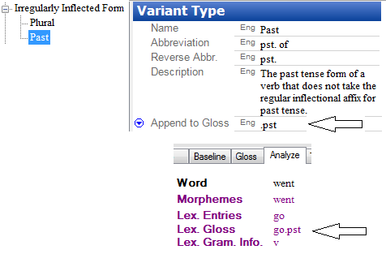

# Append to Gloss example

*User Interface › Field Descriptions › Lists › Variant Types fields*

In a lexical entry for the English word *go*, a variant form would be *went*, an irregular past tense. If the [Variant Type field](../../Lexicon/Lexicon_Edit_fields/Variants_level_fields/Variant_Type_field.md) for *went* is set to **Past**, then *go.pst* appears in the **Lex. Gloss** row when you analyze the word *went*.

- Here is how the **Variant Type** list item (**Lists**) and the **Analyze** tab (**Texts & Words**) would appear:

> [!TIP]
>
> - [Prepend to Gloss](Prepend_to_Gloss.md) would prepend instead of append.
>
> - <a href="https://www.eva.mpg.de/lingua/resources/glossing-rules.php" target="_blank" title="https://www.eva.mpg.de/lingua/resources/glossing-rules.php">https://www.eva.mpg.de/lingua/resources/glossing-rules.php</a> has examples.
>
> - On the [Help](../../../Menus/Help/Help_overview.md) menu, point to **Resources**, and then click **Introduction to Parsing** for additional information about how parsers use irregularly inflected forms.

## Related topics
[About Variant Types](../../../../Using_Tools/Lists_tools/About_Variants.md)

[Append to Gloss field](Append_to_Gloss.md)

[Convert variants utility](../../../Menus/Tools/Convert_variants_utility.md)
