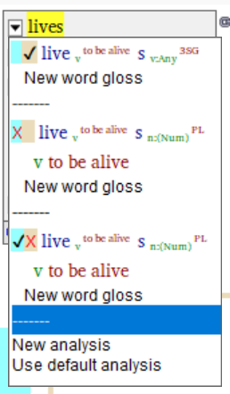

# Parse result field

*User Interface › Field Descriptions › Texts & Words*

**Full name:** **Parse result**

**Location:** Below one or more analyses in the **Wordform Analyses** pane in [Word Analyses](../../../Using_Tools/Texts_&_Words_tools/Word_Analyses/Word_Analyses_overview.md)

**Description:**

For each analysis of the current word, this field displays one of the following:

- **Successful** or **Failure** for the last parse accomplished by the selected [parser](../../Menus/Parser/Parsing_words_overview.md).

- **Untested** if the parser has not run since the analysis was created *or* after the **Parser** menu command **Clear Current Word's Parser Analyses** was used or the **Remove Parser Approved Analyses** utility was run.

Analyses that are set to **User Disapproved** but continue to show **Successful** in this field indicate that your grammar or constraints (environments, rules, and so on) permit an invalid parse and consequently need additional work.

**Tasks:**

- You *cannot* change the content in this field, except by correcting the reason that the parse failed (or by using [Clear Current Word's Parser Analyses](../../Menus/Parser/Clear_current_parser_analyses.md) or running the [Remove Parser-Approved Analyses](../../Menus/Tools/Language_Project_Utilities_overview.md) utility).

- **See also:** [Texts & Words overview](../../../Using_Tools/Texts_%26_Words_tools/Texts_and_Words_overview.md)

**Field type:** Not Editable

**Writing systems:** English

**Note:**

- [Try a Word](../../Menus/Parser/Try_a_word.md) results do not update this field.

- [Interlinear view colors](../../../Using_Tools/Texts_&_Words_tools/Interlinear_Texts/interlinear_views_colors.md) discusses that **Successful** here is shown as a check mark , and **Failure** here is shown as a red X . Tan indicates parser results, blue indicates user decisions.\
  Example:\
  

**:**

## Related topics
[FieldWorks Project Utilities overview](../../Menus/Tools/Language_Project_Utilities_overview.md)

[Texts & Words fields overview](Texts_&_Words_fields_overview.md)

[Word list columns](../../../Using_Tools/Texts_&_Words_tools/Word_list_columns.md)
