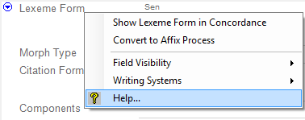

# Field Descriptions overview

*User Interface › Field Descriptions*

The descriptions for the standard fields (*not* [custom fields](../Menus/Tools/Custom_Fields/Custom_Fields_overview.md)) are grouped below by [Navigation Pane](../Toolbars/Navigation/Navigation_Pane_overview.md) areas as follows:

- [Lexicon](Lexicon/Lexicon_fields_overview.md)

- [Texts & Words](Texts_&_Words/Texts_&_Words_fields_overview.md)

- [Grammar](Grammar/Grammar_fields_overview.md)

- [Notebook](Notebook/Notebook_fields_overview.md)

- [Lists](Lists/Lists_fields_overview.md)

> [!TIP]
>
> - Click a field to see its menu button . The menu command **Help** opens the field description topic for that field. You can also right-click the field label to see the same menu. Example:
>
> 
>
> - You often can [change the visibility](../../Basic_Tasks/Showing_and_hiding_fields/change_the_visibility_of_fields.md) of fields individually, or [show or hide groups of fields](../../Basic_Tasks/Showing_and_hiding_fields/Hide_show_gps_of_flds.md). Or, you can [hide or show writing systems](../../Advanced_Tasks/Writing_Systems/Modifying_a_Writing_System/Hide_or_show_a_writing_system.md).
>
> - Each topic includes the *abbreviation* of the field name (field label), if there is one. **See:** [Change the width of the field label area](Field_Types/change_the_width_of_the_field_label_area.md).
>
> - In the dictionary preview pane, right-click the part of the entry that you want to edit, and then **Jump to field**. This will move the cursor to the field that stores that part of the entry.
>
> - For a different set of field descriptions, point to **Resources** on the [Help](../Menus/Help/Help_overview.md) menu, and then click **Intro to Lexicography**.

## Related topics
[About Lexical Entries and Senses](../../Using_Tools/Lexicon_tools/Lexicon_Edit/About_Lex_Edit_fld_levels.md)

[Configure writing systems for fields](../../Basic_Tasks/Showing_Writing_Systems/configure_field_WSs.md)

[Field Types](Field_Types/field_types_overview.md)

[Show or hide fields overview](../../Basic_Tasks/Showing_and_hiding_fields/Show_hiding_flds_oview.md)

[Text Chart tab columns and rows](../../Using_Tools/Texts_&_Words_tools/Interlinear_Texts/Text_Chart_tab/Text_Chart_tab_columns_and_rows.md)

[User Interface overview](../User_Interface_overview.md)
