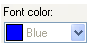

# Font

*User Interface › Menus › Format*

You can specify a font and its features (size, color and so on) for the bullets and numbers available for use in [multi-paragraph text fields](../../Field_Descriptions/Field_Types/Multiparagraph_text_field.md). To do this, do the following steps.

1.  Select the [style](Styles/Styles_overview.md) you want to modify in the **Styles** pane of the **Styles** dialog box, and then click the [Bullets and Numbering](Styles/Styles_Bullets_and_Numbering_tab.md) tab.

2.  Select **Bullet** or **Number**.

    The **Bullet and Number Font** button becomes available.

3.  Click **Bullet and Number Font**.

    The **Font** dialog box appears.

4.  Do any of the following to set font attributes:

    - In the **Font** list, select a font name (typeface), *if* the fonts are available for selection.

    - In the **Size** list, select a font size.

    - In the **Font color** list, select a color.

    - In the **Background** list, select a color for the background. (**Unspecified** allows the background color to be inherited from an underlying style.)

    - In the **Underline style** list, select a style for underlines, or select **None** to not use underlines.

    - In the **Underline color** list, select a color for the underlines.

    - Select or clear the **Bold**, **Italic**, **Superscript** or **Subscript** check box, *if* a desired check box is available.

    - If the selected font is Graphite-enabled, select **Font Features**.

    - In the **Position** list, select the vertical position of the text relative to the baseline. In the **By** box, enter or select the number of points to raise or lower the text.

5.  Review the preview in the **Preview** pane. If it looks correct, click **OK**.

> [!NOTE]
>
> - You cannot apply a different font to Graphite-enabled text.
>
> - In the **Position** box, **Normal** means that the text is not raised or lowered.
>
> - The **Preview** box displays the *look* of the formatting attributes.
>
> - Inherited values of some [unspecified attributes](Styles/Inheriting_unspecified_attributes.md) can appear with a sample, but the name shown in gray.\
>   Example:.

## Related topics
[About Font Features](../../../Advanced_Tasks/Writing_Systems/Modifying_a_Writing_System/about_font_features.md)

[Font tab, Writing System Properties](../../../Advanced_Tasks/Writing_Systems/Modifying_a_Writing_System/Writing_System_Properties_Fonts_tab.md)

[Styles overview](Styles/Styles_overview.md)
