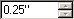
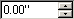

# Inheriting unspecified attributes

*User Interface › Menus › Format › Styles*

The value of an inherited attribute appears in gray. A style *inherits unspecified attributes* from the parent style. The parent style appears in the **Based on** box on the **General** tab of the **Styles** dialog box.

Modify only the attributes that need to be different from the parent style and leave the other attributes unspecified, so that you can modify them later in the parent style.

Most formatting attributes can be in the following three states: selected, cleared or inherited. If an attribute is selected or cleared, it does not inherit its value from the parent style.

|  |  |  |  |
|----|----|----|----|
| To change to inherited | Selected | Cleared | Inherited |
| Click a check box until it looks like this: . |  |  |  |
| In a list, click **Inherited** or **(unspecified)**. When you move to another attribute, the inherited value appears in gray. |  |  |  |
| In a numeric box, click the number, and then press `Delete`. When you move to another attribute, the inherited value appears in gray. |  |  |  |

## Related topics
[Styles overview](Styles_overview.md)

[Select the parent style](Select_the_parent_style.md)
