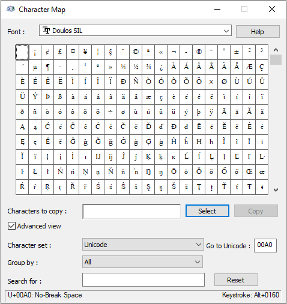

# Insert a NBSP

*User Interface › Menus › Insert*

A NBSP is referred to as either a *non-breaking space* or a *no-break space*. You might need to insert them in [example sentences](../../../Using_Tools/Lexicon_tools/Lexicon_Edit/Insert_an_example_in_a_sense.md) or when you [prepare texts](../../../Using_Tools/Texts_%26_Words_tools/Interlinear_Texts/Text_preparation_before_analyzing.md).

1.  Click the place in your phrase, sentence or text where you want the insertion point (the place where you want to insert the character).

2.  Press and hold the **Alt** key and type `0160`.

> [!TIP]
>
> You can use the **Character Map** dialog box to learn its keystroke or copy a NBSP to your computer clipboard.
>
> 1.  On the **Insert** menu, click  **Special character**.
>
> The **Character Map** dialog box appears (example below).
>
> 2.  In the **Font** box, select Doulos SIL.
>
> 3.  Select () **Advanced view**.
>
> 4.  Type the Unicode value **00A0** in the **Go to Unicode** box.
>
> 5.  Click **Select** to put the NBSP in the **Characters to copy** box.
>
> 6.  Click **Copy** to put the NBSP on your computer's clipboard.
>
> 7.  Click the place in your phrase, sentence or text where you want the insertion point (the place where you want to insert the character).
>
> 8.  [Paste](../Edit/Cut_copy_and_paste.md) (**Ctrl+V**) it at the location of the insertion point.

### Example

- Notice **U+00A0: No-Break Space** and **Keystroke: Alt+0160** appear in the lower corners.

### 

## Related topics
[Insert overview](Insert_overview.md)

## Related links
<a href="https://en.wikipedia.org/wiki/Non-breaking_space" target="_blank" title="https://en.wikipedia.org/wiki/Non-breaking_space">https://en.wikipedia.org/wiki/Non-breaking_space</a>

<a href="https://sites.psu.edu/symbolcodes/windows/codealt/" target="_blank" title="https://sites.psu.edu/symbolcodes/windows/codealt/">https://sites.psu.edu/symbolcodes/windows/codealt/</a>

<a href="https://www.webnots.com/alt-key-windows-shortcuts/" target="_blank" title="https://www.webnots.com/alt-key-windows-shortcuts/">https://www.webnots.com/alt-key-windows-shortcuts/</a>
