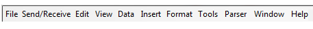

# Menus overview

*User Interface › Menus*

The menu bar displays the names of the available menus near the top of the window, above the [toolbars](../Toolbars/Toolbars_overview.md). Click an item on the menu bar to see a list of commands.

|  |  |
|----|----|
| Use | To |
| [File](File/File_overview.md) | work on FieldWorks projects, print, archive (to RAMP), back up/restore, import/export data, publish and so on. |
| [Send/Receive](Send_Receive/Send_Receive_menu.md) | collaborate with others and learn about Chorus. |
| [Edit](Edit/Edit_overview.md) | use commands to help you manipulate and find data. |
| [View](View/View_overview.md) | refresh the window, change the display (similar to the [Navigation Pane](../Toolbars/Navigation/Navigation_Pane_overview.md)), work with filters, hide/show fields or the dictionary preview pane. |
| [Format](Format/Format_overview.md) | work with [styles](Format/Styles/Styles_overview.md) or [writing systems](../../Advanced_Tasks/Writing_Systems/Writing_Systems_overview.md). |
| [Data](Data/Data_overview.md) | use commands to move around in your data, particularly useful while analyzing texts. |
| [Insert](Insert/Insert_overview.md) | use commands to add fields, list items, features, links, modes and so on, which are applicable to the current tool or window. |
| [Tools](Tools/Tools_overview.md) | use commands to *configure various views*, open utilities, work with custom fields, work with vernacular spelling checking, change user interface language, and more. |
| [Parser](Parser/Parser_menu_overview.md) | use parser commands. |
| [Window](Window/Window_overview.md) | display data in multiple windows. |
| [Help](Help/Help_overview.md) | get information and training materials for Language Explorer, including demo movies. |

> [!TIP]
>
> - [Context-sensitive menus](../../Basic_Tasks/Show_data/Context_sens_menus.md), [Field Descriptions overview](../Field_Descriptions/field_descriptions_overview.md) and [Information bar overview](../Toolbars/information_bar_overview.md) discuss other menus.

## Related topics
[Shortcut keys overview](../Shortcuts/shortcut_keys_overview.md)

[Status bar](../Toolbars/status_bar.md)

[Toolbars overview](../Toolbars/Toolbars_overview.md)

[User Interface overview](../User_Interface_overview.md)
