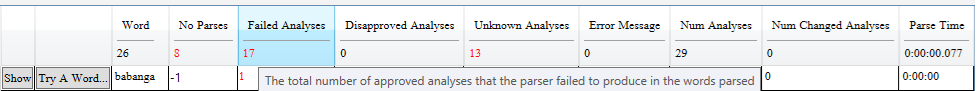

# Parser Test Reports

*User Interface › Menus › Parser*

Various test reports help you evaluate the performance of your computational parser [setup](Parsing_words_overview.md). Then, you can have Testbed texts that you use for regression tests to make sure the parser continues to work as expected.

Running tests does not change any of the analyses in the **Word Analyses** [area](../../../Using_Tools/Texts_&_Words_tools/Word_Analyses/Word_Analyses_overview.md). That is, it does not change FLEx's ideas about the number of successful analyses, or failed parses, or user approved/disapproved analyses.

## Individual test reports

A report window appears each time you use any of these **Parser** [menu](Parser_menu_overview.md) options:

- ****Run Tests ** On Current Text**

- **Run Tests  On Genre**

The **Choose Genre** dialog box opens so you can choose a [genre](../../Field_Descriptions/Texts_&_Words/Genres_field_Info.md). Then, then test is run on any text with that genre [metadata](../../../Using_Tools/Texts_&_Words_tools/Interlinear_Texts/Enter_text_metadata.md).

- ******Run Tests **** On All Texts**

In each case, the report shows the results of that check. Results data include the number of words parsed, parse time, and so on, as described in tool-tips. [Parser menu overview](Parser_menu_overview.md) describes the **Updates Word Analyses** command.

Here are things you can do:

- Click a column heading to sort the results based on that column. You can use **Shift**+click on another column to have a secondary sort.

- Click the **Save Report** button, type a *brief* comment, and then click **OK**.

Your comment appears next to the **Save Report** button and also in the **Comment** column in the **Parser Test Reports** dialog box.

To edit a comment, click **Save Report** again and retype the comment.

- Click the **Show** button to see the analyses for the word in the **Word Analyses** [tool](../../../Using_Tools/Texts_&_Words_tools/Word_Analyses/Word_Analyses_overview.md).

- Click the **Try A Word** button for a word to open it in the **Try a Word** [dialog box](Try_a_word.md). It gives you the option to see a detailed trace of the parsing process.

## Multiple test reports

To see the **Parser** **Test Reports** window, on the **Parser** [menu,](Parser_menu_overview.md) point to **Run Tests** and then click **Show Test Reports**.

In this case, you see a table. Each row is a separate test report.

Here are things you can do:

- Select () one row, and then click the **Show Report** button.

This opens that particular test report. Then in that test report, click the **Show** button to see the analyses for the word in the **Word Analyses** [tool](../../../Using_Tools/Texts_&_Words_tools/Word_Analyses/Word_Analyses_overview.md).

- Select () one row, and then click the **Save Report** button.

This opens a dialog box where you can enter a comment about the particular report. Click the **OK** button to save the report.

- Select () two rows, and then click the **Compare** button.

This opens a **Diff** table which shows the difference between two test reports.

The older report is subtracted from the newer report.

- Select () one or more rows. Then, click the **Delete** \# **Reports** button.

> [!IMPORTANT]
>
> - Informative tool-tips appear when you hold your mouse pointer over most buttons and column headers.
>
> - To change the font size of the report, on the **Format** menu, click **Styles**. Then click the **Font** [tab](../Format/Styles/Styles_Font_tab.md) and change the **Size** attribute.
>
> - Typically, the number that appears with a red color means there is a problem. A negative number means the number went lower (down).
>
> Here is an example from a **Diff** table:
>
> 
>
> In this example for the word "babanga" the number of **No Parses** shows a negative value, that is *good*; the number of **Failed Analyses** went up, that is *not* good.
>
> **Num Changed Analyses**: The number of changed analyses is computed by adding the number of parse analyses that do not match any Wordform Analyses to the number of Wordform Analyses that do not match any parse analyses. A parse analysis can match more than one wordform analysis since wordform analyses can have glosses and categories as well as morphemes. Matching only takes morphemes into account. This feature would be useful when you are trying to make the grammar parse faster without losing any valid analyses.
>
> You might want to [get more help](../../../Overview/Technical_support.md).
>
> **Related Topics**
>
> [Parser menu overview](Parser_menu_overview.md)
>
> [Parsing words overview](Parsing_words_overview.md)
>
> [Texts & Words overview](../../../Using_Tools/Texts_&_Words_tools/Texts_and_Words_overview.md)
