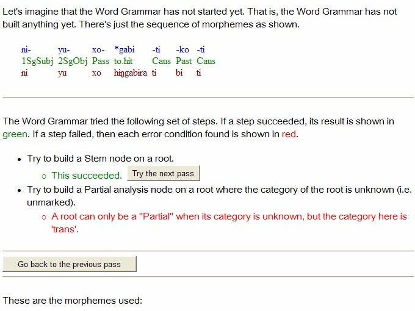
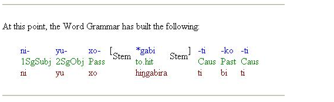
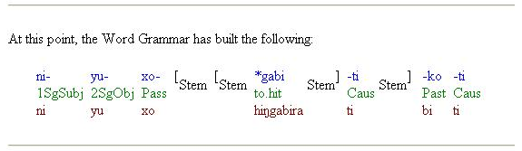
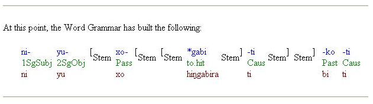

# Try the next pass example

*User Interface › Menus › Parser*

In the **Try a Word** dialog box, one of the paragraphs reads as follows (emphasis added):

"The Word Grammar tries to build a word in a number of ways in various kinds of steps. This tool shows what happens at a particular *pass*. It shows all the steps that the Word Grammar tried at this *pass*. Look for a step that would be reasonable given your understanding of how the wordform should be parsed. If such a step is shown as *succeeding*, click the 'Try the next pass' button to see the next *pass*. If such a step failed, read the description of the failure(s) and try to figure out how to correct it."

## Underlying principle

The word grammar "builds" a word **from the stem outwards**. If you click the **Try the next pass** button, it displays what it has done in the previous pass(es). Each pass builds more of the word structure.

## Example

This example is for the Kalaba word *niyuxogabitikoti*.

Notice, in the example that follows, how the bracketing \[ \] outlines how the stem is being built. First the brackets are around only a root, then around a root and suffix, and then around a prefix, root, and suffix. *Thus, each pass builds more of the word structure*.

To see how the **Try the next pass** feature works, we can begin with this page:

<table width="100%">
<tbody>
<tr>
<th style="width: 26%">
Allomorph
</th>
<th style="width: 33%">
Type
</th>
<th style="width: 41%">
Other info
</th>
</tr>
&#10;<tr>
<td style="width: 26%">
ni-

1SgSubj

ni
</td>
<td style="width: 33%">
inflectional affix
</td>
<td style="width: 41%">
Slot = (Subject)
</td>
</tr>
<tr>
<td style="width: 26%">
yu-

2SgObj

yu
</td>
<td style="width: 33%">
inflectional affix
</td>
<td style="width: 41%">
Slot = Object
</td>
</tr>
<tr>
<td style="width: 26%">
xo-

Pass

xo
</td>
<td style="width: 33%">
derivational prefix
</td>
<td style="width: 41%">
From category = bitrans

To category = trans

To inflection class = 2
</td>
</tr>
<tr>
<td style="width: 26%">
*gabi

to hit

higabira
</td>
<td style="width: 33%">
root
</td>
<td style="width: 41%">
Category = trans

Inflectional class = 1
</td>
</tr>
<tr>
<td style="width: 26%">
-ti

Caus

ti
</td>
<td style="width: 33%">
derivational suffix
</td>
<td style="width: 41%">
From category = trans

To category = bitrans

To inflection class = 1
</td>
</tr>
<tr>
<td style="width: 26%">
-ko

Past

bi
</td>
<td style="width: 33%">
inflectional affix
</td>
<td style="width: 41%">
Slot = Tense
</td>
</tr>
<tr>
<td style="width: 26%">
-ti

Caus

ti
</td>
<td style="width: 33%">
derivational suffix
</td>
<td style="width: 41%">
From category = intrans

To category = trans

To inflectional class = 1
</td>
</tr>
</tbody>
</table>

- Clicking the **Try the next pass** button on the first success results in the following:

- Then, clicking the **Try the next pass** button on the new first success results in the following:

- Then, clicking the **Try the next pass** button on the new first success results in the following:

## Related topics
[Parser menu overview](Parser_menu_overview.md)

[Parsing words overview](Parsing_words_overview.md)

[Texts & Words overview](../../../Using_Tools/Texts_%26_Words_tools/Texts_and_Words_overview.md)
