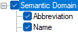

# Abbreviation and Name (ClassifiedDict)

*User Interface › Menus › Tools › Configure Classified Dictionary*

When you configure [list reference fields](../../../Field_Descriptions/Field_Types/List_reference_field.md) in the **Configure Classified Dictionary** [dialog box](Configure_Classified_Dictionary_View_dlgbox.md), **Abbreviation** and **Name** often appear together. You can choose to display of the referenced item's abbreviation, full name, or both abbreviation and name in [Classified Dictionary](../../../../Using_Tools/Lexicon_tools/Classified_Dictionary/Classified_Dictionary_overview.md).

<table width="100%">
<tbody>
<tr>
<th>
<strong>Example</strong>
</th>
<th>
<strong>Description</strong>
</th>
</tr>
&#10;<tr>
<td>

</td>
<td>
<strong>Abbreviation</strong>: <a href="../../../Field_Descriptions/Lists/Semantic_Domains_fields/abbreviation_field_semantic_domains.md">Abbreviation</a> field (Semantic Domains)

<strong>Name</strong>: <a href="../../../Field_Descriptions/Lists/Semantic_Domains_fields/name_field_semantic_domains.md">Name</a> field (Semantic Domains)
</td>
</tr>
</tbody>
</table>

> [!NOTE]
>
> - List reference fields reference and display content from other areas such as from [Lists](../../../../Using_Tools/Lists_tools/List_item_usage_table.md) and [Grammar](../../../../Using_Tools/Grammar_tools/grammar_overview.md).

## Related topics
[Abbreviation and Name (Dictionary)](../Configure_Dictionary/abbreviation_and_name.md)

[Configuring a Classified Dictionary layout](Configuring_a_Classified_Dictionary_view.md)
