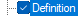

# Configuring a Classified Dictionary layout

*User Interface › Menus › Tools › Configure Classified Dictionary*

Do the following in the **Configure Classified Dictionary Layout** [dialog box](Configure_Classified_Dictionary_View_dlgbox.md):

1.  Below **Choose the layout to configure**, click the down arrow () and then click the [layout](Manage_Classified_Dictionary_Views.md) you want to configure.

2.  Do any of the following in the *left* pane of the **Configure** area:

    - Click any  to expand the hierarchical list.

    - [Duplicate](Duplicate_a_field_(ClassifiedDict).md) or [remove](Remove_a_duplicate_field_(ClassifiedDict).md) a field or group of fields.

    - Click a field or node () to *highlight* it (such as ). Then, click  or  to reorder of the display of content in relation to other fields.

    - Select () each field or node that you want to display; Clear () each one that you do not want to display. **See Also:** [Abbreviation and Name](Abbreviations_Names_ClassifiedDict.md).

<!-- -->

3.  Click a selected field or node. Then, do *any* of the following in the *right* pane:

    - At the top of the pane, verify that the correct field is shown.

      - If a **Configure now** link is shown, click it to move to the next configurable field.

    - Select or clear **Display if data present**. (This is equivalent to selecting or clearing the field or node as described above.)

    - For **Referenced Sense Headword**, click [Configure Headword Numbers](../Configure_Headword_Numbers/Config_Hdwrd_Numbers_dialog_box.md).

    - For **Grammatical Info**, select or clear **If all senses share the grammatical information, show it first**.

    - If a **Writing systems** pane is shown, select each writing system you want to use to display content from the current field.

      If **Default Vernacular** or **Default** **Analysis** has a check mark and you select another writing system, the “default” check box is cleared to prevent duplicate writing systems.

    - If a **Writing systems** pane is show, click a writing system name (to *highlight* it), and then click  or  to reorder the display of content from the current field, based on writing systems.

    - If a **Character Style** box appears, select the character style you want to use for the current field (for all writing systems). To apply a different style to *each* writing system for a field, [duplicate the field](Duplicate_a_field_(ClassifiedDict).md). Then limit each copy of the field to one writing system and configure each separately.

    - If the **Styles** button appears, click it to open the [Styles](../../Format/Styles/Styles_overview.md) dialog box so you can add, delete or modify styles. **See Also:** [Styles for export](../../File/Pathway_Configuration_Tool/Styles_for_export.md).

    - If **Surrounding Context** is shown, enter symbols, punctuation, or spaces as desired in the **Before**, **Between** and **After** boxes. **See Also:** [Surrounding Context](../Configure_Dictionary/Surrounding_Context.md) and [About the Classified-Headword style](../../Format/Styles/About_the_Classified-Headword_style.md).

    - If the **Display Writing System Abbreviations** check box appears and is available, select it to display the [abbreviation](../../../Field_Descriptions/Field_Types/Single_line_text_field_example_graphic.md) for the writing system(s) used in the entry. These are available for selection when two or more different writing systems are selected in the **Writing system(s)** pane.

    - If the **Sense Number Configuration** pane is shown, [configure the sense numbers](Sense_Number_Configuration_(ClassifiedDict).md).

    - For **Referenced Complex Forms**, select or clear **Display each Complex Form indented on the new line**.

    - If you selected **Pictures** (), choose **Left**, **Center** or **Right** with the **Alignment** control, and then enter values for the **Max Width** and **Max Height** in inches.

4.  Click **OK**.

## Related topics
[Configure Headword Numbers dialog box - Classified Dictionary](../Configure_Headword_Numbers/Configure_Headword_Numbers_dialog_box_Classified_Dictionary.md)

[Technical Support](../../../../Overview/Technical_support.md)

[What is a publication?](../../../Field_Descriptions/Lists/Publications/What_is_a_Publication.md)
