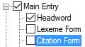

# Citation Form

*User Interface › Menus › Tools › Configure Dictionary*

In the [left pane](About_the_left_pane.md), **Citation** **Form** appears under **Main** **Entry**, **Minor Entry (Complex Forms)**, **Minor Entry (Variants)** and **<a href="Subentries.md" style="font-weight: normal;">Subentries</a>**.

<table>
<tbody>
<tr>
<th>
<strong>Example</strong>
</th>
<th>
<strong>Description</strong>
</th>
</tr>
&#10;<tr>
<td>

</td>
<td>
This item controls the appearance of <strong>Dictionary</strong> content from the <a href="../../../Field_Descriptions/Lexicon/Lexicon_Edit_fields/Entry_level_fields/Citation_Form_field.md">Citation Form</a> field.

If both <strong>Citation</strong> <strong>Form</strong> and <a href="Headword.md">Headword</a> are selected with a check mark, then entries with content in the <strong>Citation Form</strong> field will contain that form <em>twice</em>.

However each is independently configurable, so you can specify different writing systems, styles, and surrounding context.
</td>
</tr>
</tbody>
</table>

## Related topics
<a href="Configure_Dictionary.md" style="font-weight: normal;">Configure Dictionary dialog box</a>
