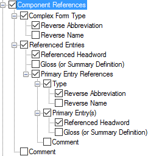

# Component References

*User Interface › Menus › Tools › Configure Dictionary*

In the [left pane](About_the_left_pane.md), **Component References** appears in these places:

- *lexeme*-based [layouts](Dictionary_views.md), under **Main** **Entry**

- *hybrid* layouts, under [\[References Section\]](References_Section_(Config._Dict.).md)

- *root*-based layouts, see [Components](Components.md).

**I**n the *right* pane, below **Complex Form Types**, select () each [complex form type](../../../../Using_Tools/Lists_tools/About_complex_forms.md) you want to display. Optionally, you can do the following:

  - In the *left* pane, you can [duplicate](Duplicate_Dict_field.md) **Component References**, and then select different types to display in each instance.

  - Use up arrows or down arrows to reorder the instances (*left* pane), or selected types (*right* pane).

<table width="100%">
<tbody>
<tr style="height: 20px;">
<th colspan="2" style="width: 20.409%">
<strong>Example</strong>
</th>
</tr>
&#10;<tr style="height: 131px;">
<td style="width: 20.409%">

</td>
<td style="width: 79.591%"></td>
</tr>
<tr style="height: 124px;">
<td colspan="2" style="width: 20.409%">
If selected (), contents from these fields are displayed:

<ul>
<li>
<strong>Complex Form Type</strong>: <a href="../../../Field_Descriptions/Lists/Complex_Form_Types_flds/reverse_abbr_fld_(complex_fm_types).md">Reverse Abbreviation</a>, <a href="../../../Field_Descriptions/Lists/Complex_Form_Types_flds/Reverse_Name_field_(Complex_Form_Types).md">Reverse Name</a>, or both from the <strong>Complex Form Types</strong> <a href="../../../../Using_Tools/Lists_tools/List_item_usage_table.md">list</a>.
</li>
<li>
<strong>Referenced Entries</strong>
</li>
<li><ul>
<li>
<strong>Referenced Headword</strong>: <a href="../../../Field_Descriptions/Lexicon/Lexicon_Edit_fields/Entry_level_fields/Components_field.md">Components</a> field. 
You may also see a <a href="../Configure_Headword_Numbers/Config_Hdwrd_Numbers_dialog_box.md">sense number</a>.
</li>
<li>
<strong>Gloss (or Summary Definition)</strong>: if <strong>Specific Sense</strong> is selected, the <a href="../../../Field_Descriptions/Lexicon/Lexicon_Edit_fields/Sense_level_fields/Gloss_field_Sense.md">gloss</a> from that sense; otherwise, the <a href="../../../Field_Descriptions/Lexicon/Lexicon_Edit_fields/Entry_level_fields/Summary_Definition_field.md">Summary Definition</a> field.
</li>
<li>
<strong>Primary Entry References</strong>:
</li>
<li><ul>
<li>
<strong>Type:</strong> <a href="../../../Field_Descriptions/Lists/Complex_Form_Types_flds/reverse_abbr_fld_(complex_fm_types).md">Reverse Abbreviation</a> or <a href="../../../Field_Descriptions/Lists/Complex_Form_Types_flds/Reverse_Name_field_(Complex_Form_Types).md">Reverse Name</a> from the <strong>Complex Form Types</strong> <a href="../../../Field_Descriptions/Lists/Complex_Form_Types_flds/complex_fm_types_flds_overview.md">list</a> as selected in the <a href="../../../Field_Descriptions/Lexicon/Lexicon_Edit_fields/Entry_level_fields/Complex_Form_Type_field.md">Complex Form Type</a> field in the referenced complex entry, <em>or</em> <a href="../../../Field_Descriptions/Lists/Variant_Types_flds/Reverse_Abbr_fld_Variant_Types.md">Reverse Abbreviation</a> or <a href="../../../Field_Descriptions/Lists/Variant_Types_flds/Reverse_Name_field_(Variant_Types).md">Reverse Name</a> from the <strong>Variant Types</strong> <a href="../../../Field_Descriptions/Lists/Variant_Types_flds/variant_types_flds_overview.md">list</a> as selected in the <a href="../../../Field_Descriptions/Lexicon/Lexicon_Edit_fields/Entry_level_fields/Variant_Type_field.md">Variant Type</a> field in the referenced variant entry.
</li>
<li>
<strong>Referenced Headword</strong>: the headword of the referenced complex form or variant entry.
</li>
<li>
<strong>Gloss (or Summary Definition)</strong>: the <a href="../../../Field_Descriptions/Lexicon/Lexicon_Edit_fields/Sense_level_fields/Gloss_field_Sense.md">gloss</a> from the chosen sense when <strong>Specific Sense</strong> is selected. If there is no gloss, then the <a href="../../../Field_Descriptions/Lexicon/Lexicon_Edit_fields/Entry_level_fields/Summary_Definition_field.md">Summary Definition</a> field from the referenced entry.
</li>
<li>
<strong>Comment</strong>: <a href="../../../Field_Descriptions/Lexicon/Lexicon_Edit_fields/Entry_level_fields/Comment_field.md">Comment</a> field associated with the <strong>Complex Form Type</strong> field or with the <strong>Variant Type</strong> field.
</li>
</ul></li>
</ul></li>
<li><ul>
<li>
<strong>Comment</strong>: <a href="../../../Field_Descriptions/Lexicon/Lexicon_Edit_fields/Entry_level_fields/Comment_field.md">Comment</a> field of referenced entry.
</li>
</ul></li>
</ul></td>
</tr>
</tbody>
</table>

> [!NOTE]
>
> - **Primary Entry References** allows references to variants or complex forms to display the main entry of the referenced form.

## Related topics
[Abbreviation and Name](abbreviation_and_name.md)

[Configure Dictionary dialog box](Configure_Dictionary.md)

[Complex Forms](Complex_Forms.md)
