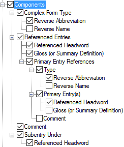

# Components, Configure Dictionary

*User Interface › Menus › Tools › Configure Dictionary*

In *root***-based [layouts](Dictionary_views.md),** the [left pane](About_the_left_pane.md), **Components** appears under **Minor Entry (Complex Form)** and **Minor Entry (Variants)****.**

For *lexeme***-based and** *Hybrid* layouts, see **[Component References](Component_References.md).**

- **I**n the *right* pane, below **Complex Form Types**, select () each [complex form type](../../../../Using_Tools/Lists_tools/About_complex_forms.md) you want to display. Optionally, you can do the following:

  - In the *left* pane, you can [duplicate](Duplicate_Dict_field.md) **Components**, and then select different types to display in each instance.

  - Use up arrows or down arrows to reorder the instances (*left* pane), or selected types (*right* pane).

<table width="100%">
<tbody>
<tr>
<th colspan="2">
<strong>Example</strong>
</th>
</tr>
&#10;<tr>
<td>

</td>
<td></td>
</tr>
</tbody>
</table>

<table width="100%">
<tbody>
<tr>
<td>
If selected (), contents from these fields are displayed:

<strong>Components</strong>:

<ul>
<li>
<strong>Complex Form Type</strong>: <a href="../../../Field_Descriptions/Lists/Complex_Form_Types_flds/reverse_abbr_fld_(complex_fm_types).md">Reverse Abbreviation</a> or <a href="../../../Field_Descriptions/Lists/Complex_Form_Types_flds/Reverse_Name_field_(Complex_Form_Types).md">Reverse Name</a>, or both from the <strong>Complex Form Types</strong> <a href="../../../../Using_Tools/Lists_tools/List_item_usage_table.md">list</a>.
</li>
<li>
<strong>Referenced Entries</strong>:
</li>
<li><ul>
<li>
<strong>Referenced Headword</strong>: <a href="../../../Field_Descriptions/Lexicon/Lexicon_Edit_fields/Entry_level_fields/Components_field.md">Components</a> field. 
If <strong>Specific Sense</strong> is selected when you <a href="../../../../Using_Tools/Lexicon_tools/Lexicon_Edit/Choose_components_for_Components_field.md">choose components</a>, then the headword and sense number of that sense can be displayed.
</li>
<li>
<strong>Gloss (or Summary Definition)</strong>: if <strong>Specific Sense</strong> is selected, the <a href="../../../Field_Descriptions/Lexicon/Lexicon_Edit_fields/Sense_level_fields/Gloss_field_Sense.md">gloss</a> from that sense; otherwise, the <a href="../../../Field_Descriptions/Lexicon/Lexicon_Edit_fields/Entry_level_fields/Summary_Definition_field.md">Summary Definition</a> field.
</li>
</ul></li>
</ul>
<ul>
<li><ul>
<li>
<strong>Primary Entry References</strong>:
</li>
<li><ul>
<li>
<strong>Type:</strong> <a href="../../../Field_Descriptions/Lists/Complex_Form_Types_flds/reverse_abbr_fld_(complex_fm_types).md">Reverse Abbreviation</a> or <a href="../../../Field_Descriptions/Lists/Complex_Form_Types_flds/Reverse_Name_field_(Complex_Form_Types).md">Reverse Name</a> from the <strong>Complex Form Types</strong> <a href="../../../Field_Descriptions/Lists/Complex_Form_Types_flds/complex_fm_types_flds_overview.md">list</a> as selected in the <a href="../../../Field_Descriptions/Lexicon/Lexicon_Edit_fields/Entry_level_fields/Complex_Form_Type_field.md">Complex Form Type</a> field in the referenced complex entry, <em>or</em> <a href="../../../Field_Descriptions/Lists/Variant_Types_flds/Reverse_Abbr_fld_Variant_Types.md">Reverse Abbreviation</a> or <a href="../../../Field_Descriptions/Lists/Variant_Types_flds/Reverse_Name_field_(Variant_Types).md">Reverse Name</a> from the <strong>Variant Types</strong> <a href="../../../Field_Descriptions/Lists/Variant_Types_flds/variant_types_flds_overview.md">list</a> as selected in the <a href="../../../Field_Descriptions/Lexicon/Lexicon_Edit_fields/Entry_level_fields/Variant_Type_field.md">Variant Type</a> field in the referenced variant entry.
</li>
<li>
<strong>Referenced Headword</strong>: the headword of the referenced complex form or variant entry.
</li>
<li>
<strong>Gloss (or Summary Definition)</strong>: the <a href="../../../Field_Descriptions/Lexicon/Lexicon_Edit_fields/Sense_level_fields/Gloss_field_Sense.md">gloss</a> from the chosen sense when <strong>Specific Sense</strong> is selected. If there is no gloss, then the <a href="../../../Field_Descriptions/Lexicon/Lexicon_Edit_fields/Entry_level_fields/Summary_Definition_field.md">Summary Definition</a> field from the referenced entry.
</li>
<li>
<strong>Comment</strong>: <a href="../../../Field_Descriptions/Lexicon/Lexicon_Edit_fields/Entry_level_fields/Comment_field.md">Comment</a> field associated with the <strong>Complex Form Type</strong> field or with the <strong>Variant Type</strong> field.
</li>
</ul></li>
</ul></li>
</ul>
<ul>
<li>
<strong>Comment</strong>: <a href="../../../Field_Descriptions/Lexicon/Lexicon_Edit_fields/Entry_level_fields/Comment_field.md">Comment</a> field.
</li>
<li>
<strong>Subentry Under</strong>: 
"<strong>see under</strong>" is added to the reference if the <strong>Show Subentry Under</strong> field does <em>not</em> show <em>all</em> the <a href="../../../Field_Descriptions/Lexicon/Lexicon_Edit_fields/Entry_level_fields/Components_field.md">components</a>.
</li>
<li><ul>
<li>
<strong>Referenced Headword:</strong> <a href="../../../Field_Descriptions/Lexicon/Lexicon_Edit_fields/Publication_Settings_flds/Show_Subentry_under.md">Show Subentry under</a> field.
</li>
</ul></li>
</ul></td>
</tr>
</tbody>
</table>

> [!TIP]
>
> - Configure sense numbers in the [Configure Headword Numbers](../Configure_Headword_Numbers/Config_Hdwrd_Numbers_dialog_box.md) dialog box.
>
> - "**see under**" is stored in the surrounding context's **Before** box.
>
> It helps clarify which component entries display the subentry when *not all* of them do.

## Related topics
[About entry types](../../../../Using_Tools/Lists_tools/About_Entry_Types.md)

<a href="Configure_Dictionary.md" style="font-weight: normal;">Configure Dictionary dialog box</a>

[Choose Lexical Entry or Sense](../../../../Using_Tools/Lexicon_tools/Lexicon_Edit/Choose_components_for_Components_field.md)

[Specify that a form is complex](../../../../Using_Tools/Lexicon_tools/Lexicon_Edit/Specify_that_Form_is_Complex.md)

[Use right-click to help configure Dictionary layouts](../../../../Using_Tools/Lexicon_tools/Dictionary/Use_right-click_to_help_configure_Dictionary_view.md)
