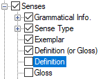

# Definition

*User Interface › Menus › Tools › Configure Dictionary*

In the [left pane](About_the_left_pane.md), **Definition** appears under each **Senses** node, but only under some of the **Subsenses** nodes. **See:** [Senses/Subsenses](Senses_Subsenses.md).

<table width="100%">
<tbody>
<tr>
<th>
<strong>Example</strong>
</th>
<th>
<strong>Description/Content Sources</strong>
</th>
</tr>
&#10;<tr>
<td>

</td>
<td>
If selected (), content from the <a href="../../../Field_Descriptions/Lexicon/Lexicon_Edit_fields/Sense_level_fields/definition_field.md">Definition</a> field is displayed. However, if a <strong>Definition</strong> field is empty, then nothing is displayed.

<strong>See also:</strong> <a href="Definition_or_Gloss.md">Definition (or Gloss)</a> and <a href="gloss.md">Gloss</a>.
</td>
</tr>
</tbody>
</table>

## Related topics
<a href="Configure_Dictionary.md" style="font-weight: normal;">Configure Dictionary dialog box</a>
