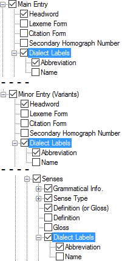

# Dialect Labels

*User Interface › Menus › Tools › Configure Dictionary*

In the [left pane](About_the_left_pane.md), **Dialect Labels** appear below various nodes in each view.

<table width="100%">
<tbody>
<tr>
<th>
<strong>Examples</strong>
</th>
<th>
<strong>Content Sources</strong>
</th>
</tr>
&#10;<tr>
<td>

<strong>See Also:</strong> <a href="Variant_Forms.md">Variant Forms</a>.
</td>
<td>
If selected (), you can display the <a href="../../../Field_Descriptions/Lists/Dialect_Labels/Abbreviation_field_(Dialect_Labels).md">abbreviation</a>, <a href="../../../Field_Descriptions/Lists/Dialect_Labels/Full_Name_field_(Dialect_Labels).md">full name</a> or both from the <strong>Dialect Labels</strong> <a href="../../../../Using_Tools/Lists_tools/List_item_usage_table.md">list</a>.
</td>
</tr>
</tbody>
</table>

## Related topics
<a href="Configure_Dictionary.md" style="font-weight: normal;">Configure Dictionary dialog box</a>

[Dialect Labels (Entry) field](../../../Field_Descriptions/Lexicon/Lexicon_Edit_fields/Entry_level_fields/Dialect_Labels_Entry.md)

[Dialect Labels (Sense) field](../../../Field_Descriptions/Lexicon/Lexicon_Edit_fields/Sense_level_fields/Dialect_Labels_(Sense).md)
