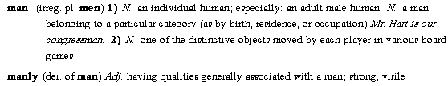
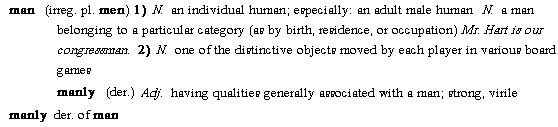

# Dictionary layouts

*User Interface › Menus › Tools › Configure Dictionary*

There are three default layouts: *Root*-based, *Lexeme*-based and *Hybrid*. You can [add more layouts](Manage_Dictionary_Views.md).

In each of the default layouts, [variants](../../../../Using_Tools/Lists_tools/About_Variants.md) are [minor entries](Main_Minor_entry.md), but [complex forms](../../../../Using_Tools/Lists_tools/About_complex_forms.md) are handled differently.

In the examples below, **manly** is a complex form (derived); **man** is one of its [components](../../../Field_Descriptions/Lexicon/Lexicon_Edit_fields/Entry_level_fields/Components_field.md).

- Lexeme-based and [hybrid](About_the_Hybrid_Dictionary_view.md) layouts: **manly** can appear as a *main* entry.

- Root-based layouts: **manly** can appear as a *minor* entry.

- Root-based and hybrid layouts: **manly** can *also* appear as a [subentry](Subentries.md), indented below **man**.

### Lexeme-based (complex forms as main entries):

### Root-based (complex forms as subentries) and\
Hybrid **(complex forms as main entries and mini subentries):**

****

## Related topics
[Add a lexical subentry](../../../../Using_Tools/Lexicon_tools/Lexicon_Edit/Add_a_lexical_subentry.md)

[Choose a dictionary layout](Choose_a_dictionary_view.md) / [Select a dictionary layout](../../../../Using_Tools/Lexicon_tools/Dictionary/Select_a_dictionary_view.md)

[Complex Forms (in Configure Dictionary)](Complex_Forms.md)

[Configure Dictionary dialog box](Configure_Dictionary.md)

[Manage Dictionary Layouts](Manage_Dictionary_Views.md)

[What is a publication?](../../../Field_Descriptions/Lists/Publications/What_is_a_Publication.md)
