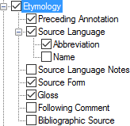

# Etymology

*User Interface › Menus › Tools › Configure Dictionary*

In the [left pane](About_the_left_pane.md), an **Etymology** node appears under **Main Entry**, **Minor Entry (Complex Form)**, and **Minor Entry (Variants)**. For [root-based](Dictionary_views.md) layouts also under **Subentries**. For [hybrid](About_the_Hybrid_Dictionary_view.md) layouts, also under **Minor Subentries**.

<table width="100%">
<tbody>
<tr>
<th>
<strong>Example</strong>
</th>
<th>
<strong>Content Sources</strong>
</th>
</tr>
&#10;<tr>
<td>

</td>
<td>
If selected (), contents from these fields are displayed:

<ul>
<li>
<a href="../../../Field_Descriptions/Lexicon/Lexicon_Edit_fields/Entry_level_fields/Preceding_Annotation_Etymology.md">Preceding Annotation</a> field
</li>
<li>
<a href="../../../Field_Descriptions/Lexicon/Lexicon_Edit_fields/Entry_level_fields/Source_Language_Etymology.md">Source Language</a> field 
<a href="../../../Field_Descriptions/Lists/Languages/abbreviation_field_Languages.md">Abbreviation</a> field; <a href="../../../Field_Descriptions/Lists/Languages/name_field_Languages.md">Name</a> field
</li>
<li>
<a href="../../../Field_Descriptions/Lexicon/Lexicon_Edit_fields/Entry_level_fields/Source_Language_Notes_(Etymology).md">Source Language Note</a> field
</li>
<li>
<a href="../../../Field_Descriptions/Lexicon/Lexicon_Edit_fields/Entry_level_fields/Source_Form_Etymology.md">Source Form</a> field
</li>
<li>
<a href="../../../Field_Descriptions/Lexicon/Lexicon_Edit_fields/Entry_level_fields/Source_Form_Etymology.md">Gloss</a> field (<em>not</em> the <strong>Gloss</strong> field in each <a href="../../../Field_Descriptions/Lexicon/Lexicon_Edit_fields/Sense_level_fields/Sense_level_fields_overview.md">sense</a>)
</li>
<li>
<a href="../../../Field_Descriptions/Lexicon/Lexicon_Edit_fields/Entry_level_fields/Following_Comment_Etymology.md">Following Comment</a> field
</li>
<li>
<a href="../../../Field_Descriptions/Lexicon/Lexicon_Edit_fields/Entry_level_fields/Bibliographic_Source_Etymology.md">Bibliographic Source</a> field.
</li>
</ul></td>
</tr>
</tbody>
</table>

> [!NOTE]
>
> - The  **Etymology** [field](../../../Field_Descriptions/Lexicon/Lexicon_Edit_fields/Entry_level_fields/Etymology_field.md) is a *header* field that cannot have contents.
>
> - **Etymology Note** [field](../../../Field_Descriptions/Lexicon/Lexicon_Edit_fields/Entry_level_fields/Etymology_Note_Etymology.md) contents cannot be included in **Dictionary**.

## Related topics
<a href="Configure_Dictionary.md" style="font-weight: normal;">Configure Dictionary dialog box</a>
